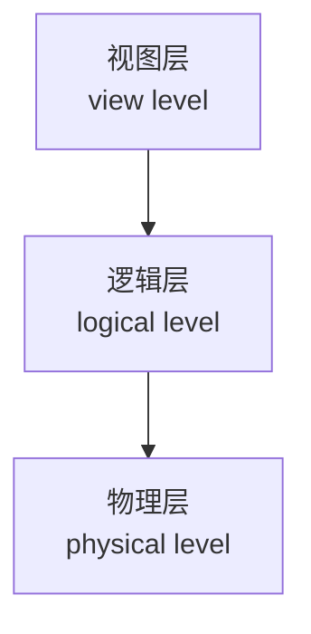
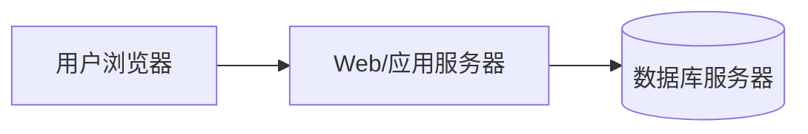

import WordCount from '../../../../src/components/WordCount/WordCount';
import Mermaid from '@theme/Mermaid';


<WordCount>


## 1.1 数据库系统应用

**数据库系统（database system）** 是相互关联的数据以及一组用以访问这些数据的程序的集合。这里所说的相互关联的数据集合通常称为**数据库（database）**。数据库系统的首要目标，是提供一种既方便又高效的环境来存取数据。

现代社会几乎任何一个具备一定规模的信息处理场景背后都有数据库系统的支撑，典型应用包括：

- **企业信息**：销售（客户、产品、订单）、会计（应付账款、总账、税务）、人力资源（员工、工资、税务）等；
- **制造业**：供应链管理、库存跟踪、订单跟踪、生产计划；
- **银行与金融**：客户账户、贷款、信用卡交易、股票交易、市场数据；
- **大学**：学生、课程、教师、成绩、注册、学费；
- **航空运输**：航班、订票、机票销售、里程积分；
- **电信**：呼叫记录、月度账单、余额；
- **Web 与社交网络**：用户资料、好友关系、内容、广告推送、日志分析。

上述应用有一个共同点：需要**长期保存大量数据**，需要**在多用户并发环境下可靠地增、删、查、改**，还需要在**发生故障时保证数据的正确性**。这正是数据库系统所要解决的问题。

---

## 1.2 数据库系统的目标

在数据库系统出现之前，人们把数据存放在操作系统提供的普通**文件（file）** 中，并用应用程序来处理。这种"文件处理系统（file-processing system）"方式存在下列严重缺点：

1. **数据冗余和不一致（redundancy and inconsistency）**：同一份信息（例如学生的地址）可能出现在多个文件中，一处修改而另一处未同步就会造成不一致。
2. **数据访问困难**：任何一个新的查询请求都要重新编写程序，缺乏灵活性。
3. **数据孤立（data isolation）**：数据散布在若干格式各异的文件中，编写取数程序困难。
4. **完整性问题（integrity problem）**：如"账户余额不小于最低值"这类约束只能硬编码到应用程序中，难以维护。
5. **原子性问题（atomicity problem）**：转账等操作必须"要么全做，要么全不做"，故障发生时文件系统很难保证。
6. **并发访问异常（concurrent-access anomaly）**：多用户同时更新同一份数据，可能因交错而丢失更新或读到不一致状态。
7. **安全性问题**：很难有选择地授予不同用户不同的访问权限。

**数据库系统**通过下列机制克服这些问题：统一的数据模型、声明式查询语言、并发控制与恢复机制、访问控制与视图机制。可以说，数据库系统的三个核心目标是：**数据独立性（data independence）**、**数据完整性和一致性**、以及**多用户并发下的正确性**。

---

## 1.3 数据视图

数据库系统面向不同层次的用户呈现出不同的"数据视图"。它同时要给用户一个便于理解的抽象接口，又要让底层实现具备高效率。

### 1.3.1 数据模型

**数据模型（data model）** 是一组用于描述数据、数据之间联系、语义以及一致性约束的概念工具。常见的数据模型有：

- **关系模型（relational model）**：用**表**（关系）来表达数据和数据间联系；
- **实体-联系模型（E-R model）**：主要用于概念设计；
- **基于对象的数据模型（object-based）**：结合面向对象与数据库特性；
- **半结构化数据模型（semi-structured）**：如 XML、JSON，允许同类型对象具有不同属性；
- **早期的层次模型和网状模型**：现已很少用作首选。

关系模型是目前商用数据库系统的主流，本书大部分内容围绕它展开。

### 1.3.2 关系数据模型

关系模型用**关系（表）** 表达数据。每个关系有一个名字，由若干列（**属性，attribute**）和若干行（**元组，tuple**）组成。例如大学示例中的关系 `instructor` 记录教师信息：

| ID    | name       | dept_name  | salary |
| ----- | ---------- | ---------- | ------ |
| 10101 | Srinivasan | Comp. Sci. | 65000  |
| 12121 | Wu         | Finance    | 90000  |
| 15151 | Mozart     | Music      | 40000  |
| 22222 | Einstein   | Physics    | 95000  |
| 32343 | El Said    | History    | 60000  |

- `ID` 属性唯一标识一位教师；
- `dept_name` 引用另一关系 `department`；
- 每一行对应现实世界的一个实体（一位教师）。

关系模型的一个突出优点是：**它对用户屏蔽了数据在磁盘上具体如何存储、如何通过什么索引访问**，用户只需描述"我要什么"，而不必描述"怎样去取"。

### 1.3.3 数据抽象

数据库系统采用三级抽象体系结构：

- **物理层（physical level）**：描述数据在磁盘上如何存储，例如以 B<sup>+</sup>-树或散列组织；
- **逻辑层（logical level）**：描述数据库中存储什么数据以及它们之间的联系，即"模式"；
- **视图层（view level）**：仅暴露整体数据库中的一部分内容给某类用户，用来简化交互并支持安全性。

三级抽象带来两级**数据独立性**：

- **物理数据独立性**：能修改物理层实现而不改动逻辑模式（例如改换索引类型）；
- **逻辑数据独立性**：能修改逻辑模式而不影响应用程序（多通过视图缓冲）。



### 1.3.4 实例和模式

- **数据库模式（schema）**：数据库的整体设计，相对稳定，类似于程序中的类型定义。
- **数据库实例（instance）**：在某一特定时刻数据库中的数据，相当于变量在某一时刻的取值。

例如 `instructor` 表的模式是 `instructor(ID, name, dept_name, salary)`，任何具体的行集合都是它的一个实例。模式与实例的区分与程序设计语言中的类型（type）与变量（value）的区分相对应。

---

## 1.4 数据库语言

数据库系统提供两类语言：**数据定义语言（DDL）** 和**数据操纵语言（DML）**。实际系统（如 SQL）通常把两者合为一体。

### 1.4.1 数据定义语言

**DDL** 用于指定数据库模式和其他属性，如存储结构、访问方法、约束等。DDL 语句的执行产生的模式描述被保存在**数据字典（data dictionary）** 中。约束的种类包括：

- **域约束（domain constraint）**：属性值必须属于给定的域，如 `salary` 必须是非负数；
- **参照完整性（referential integrity）**：一个表中某属性的取值必须出现在另一个表中；
- **断言（assertion）**：任何数据库实例都必须满足的谓词；
- **授权（authorization）**：不同用户对不同数据的读、写、更新、删除权限。

### 1.4.2 SQL数据定义语言

SQL 用 `CREATE TABLE` 声明关系，例如：

```sql
CREATE TABLE department (
    dept_name    VARCHAR(20) PRIMARY KEY,
    building     VARCHAR(15),
    budget       NUMERIC(12, 2) CHECK (budget > 0)
);

CREATE TABLE instructor (
    ID           VARCHAR(5) PRIMARY KEY,
    name         VARCHAR(20) NOT NULL,
    dept_name    VARCHAR(20),
    salary       NUMERIC(8, 2) CHECK (salary >= 29000),
    FOREIGN KEY (dept_name) REFERENCES department (dept_name)
);
```

`PRIMARY KEY`、`FOREIGN KEY`、`CHECK`、`NOT NULL` 等都属于 DDL 层次的完整性约束，由数据库引擎自动强制执行。

### 1.4.3 数据操纵语言

**DML** 让用户对数据进行操作：检索、插入、删除、修改。按方式可分为两类：

- **过程化 DML**：要求用户既说明**要什么**数据，也说明**怎样**取；
- **声明式 DML（非过程化 DML）**：只要求用户说明要什么。

SQL 属于声明式 DML。声明式的最大好处是易于书写和优化——由数据库的**查询优化器**寻找高效执行策略。

### 1.4.4 SQL数据操纵语言

以大学示例给出典型语句：

```sql
-- 检索：查询"Comp. Sci."系年薪高于 70000 的教师
SELECT name, salary
FROM   instructor
WHERE  dept_name = 'Comp. Sci.' AND salary > 70000;

-- 插入
INSERT INTO instructor VALUES ('99999', 'Newton', 'Physics', 88000);

-- 更新：为工资低于 90000 的教师加薪 5%
UPDATE instructor
SET    salary = salary * 1.05
WHERE  salary < 90000;

-- 删除
DELETE FROM instructor WHERE ID = '99999';
```

SQL 用 `SELECT-FROM-WHERE` 三段式表达检索：`FROM` 指出关系源，`WHERE` 给出选择条件，`SELECT` 指出投影属性。

### 1.4.5 从应用程序访问数据库

SQL 本身并非通用编程语言，因此实际系统往往把 SQL 嵌入到宿主语言（如 C、Java、Python）中，或者通过 API 调用发出 SQL：

- **嵌入式 SQL**：由预编译器把 SQL 转换为宿主语言的调用；
- **JDBC / ODBC / Python DB-API**：应用程序通过库函数向数据库发送 SQL 并取回结果；
- **对象-关系映射（ORM）**：将对象与关系表相互映射。

无论采取哪种方式，其本质都是让通用编程语言"借用"SQL 完成数据存取。

---

## 1.5 数据库设计

数据库设计是构造一个合适的数据库模式的过程，通常分为以下阶段：

1. **需求分析**：与用户交流，弄清应用要保存哪些信息、要支持哪些操作；
2. **概念设计**：使用 E-R 模型或 UML 类图描述现实世界中的实体和联系；
3. **逻辑设计**：把概念模式转换为具体 DBMS 支持的数据模型（通常是关系模型）；
4. **物理设计**：决定索引、文件组织、分区等；
5. **规范化**：使用函数依赖理论把关系模式分解为满足 BCNF 或 3NF 的模式。

一个好的设计要求既能准确表达业务，又能避免冗余、更新异常、插入异常和删除异常。这正是第 6、7 章的主题。

---

## 1.6 数据库引擎

**数据库引擎（database engine）** 是数据库系统的功能核心，通常由三大组件构成：**存储管理器（storage manager）**、**查询处理器（query processor）** 和**事务管理器（transaction manager）**。

### 1.6.1 存储管理器

存储管理器负责数据在磁盘和内存之间的移动，具体又分为：

- **权限与完整性管理**：检查约束和权限；
- **事务管理器**：确保并发和恢复的正确性；
- **文件管理器**：管理磁盘空间的分配和数据结构的组织；
- **缓冲区管理器**：把磁盘上的数据缓存到内存中，是决定性能的关键子系统。

除了数据本身，存储管理器还维护若干**数据字典（元数据）** 和**索引（index）** 等辅助结构。

### 1.6.2 查询处理器

查询处理器把用户提交的高级查询（如 SQL）翻译为可执行计划，其主要模块为：

- **DDL 解释器**：解释 DDL 语句并把定义存入数据字典；
- **DML 编译器**：把 DML 查询翻译为一系列**关系代数**级的操作，并进行**查询优化（query optimization）**——挑选执行代价最低的等价计划；
- **查询执行引擎**：按计划执行操作，从存储管理器取数、施加操作、返回结果。

### 1.6.3 事务管理

一次**事务（transaction）** 是数据库中的一个逻辑工作单元，它必须满足 **ACID** 性质：

- **原子性（Atomicity）**：全做或全不做；
- **一致性（Consistency）**：从一致状态过渡到另一个一致状态；
- **隔离性（Isolation）**：并发事务互不干扰，效果等价于某种串行执行；
- **持久性（Durability）**：一旦提交，效果永久保留，即使随后系统崩溃也不丢失。

事务管理器通过**日志（log）** 与**并发控制协议**（如两阶段封锁）实现 ACID。

---

## 1.7 数据库和应用体系结构

数据库应用的体系结构随着计算平台的演化经历了多个阶段：

- **两层体系结构（two-tier）**：客户端程序通过 ODBC/JDBC 直接与数据库服务器通信，客户端承担了大量业务逻辑；
- **三层体系结构（three-tier）**：在客户端和数据库之间加入一个**应用服务器**层，客户端只负责界面，业务逻辑放在应用服务器上；这是 Web 应用的通行做法；
- **N 层与云原生**：应用服务器进一步拆分为前端、微服务、消息中间件、缓存等，数据库常以分布式或云服务形态运行。



三层结构的好处是：客户端轻量、易于跨平台部署，业务逻辑集中在中间层便于维护，数据库则可以专注于数据管理与事务保证。

---

## 1.8 数据库用户和管理员

### 1.8.1 数据库用户和用户界面

数据库用户按访问方式与角色可分为四类：

- **无经验用户（naive users）**：通过预先编写好的应用界面进行交互，如自动柜员机、火车票预订终端；
- **应用程序员（application programmer）**：编写应用程序，通过嵌入式 SQL 或 API 与数据库通信；
- **老练用户（sophisticated users）**：直接使用 SQL 或数据分析工具进行自主查询，如数据分析师；
- **专门用户（specialized users）**：编写基于数据库但不属于传统数据处理范畴的应用，如 CAD、CAM、地理信息系统等。

### 1.8.2 数据库管理员

**数据库管理员（DBA, Database Administrator）** 拥有整个数据库系统的最高权限，主要职责有：

1. 模式定义与修改；
2. 存储结构与访问方法的选择；
3. 用户授权和访问权限管理；
4. 制订备份和恢复策略；
5. 监控系统性能，进行调优。

DBA 是系统运维的最后一道防线，其决策直接影响业务的可靠性和效率。

---

## 1.9 数据库系统的历史

- **20 世纪 50 年代～60 年代初**：数据以磁带批量顺序处理为主，尚无独立的数据管理系统；
- **20 世纪 60 年代**：随机存储磁盘使联机事务处理成为可能，出现了 IBM IMS（层状模型）、CODASYL DBTG（网状模型）等；
- **1970 年**：E. F. Codd 提出**关系模型**，奠定了现代数据库的理论基础；
- **20 世纪 70 年代末～80 年代**：System R、Ingres 等实验系统证明关系数据库的可行性；随后 Oracle、DB2、Sybase、Informix 等商用产品陆续出现；SQL 成为国际标准；
- **20 世纪 90 年代**：面向对象数据库和对象-关系扩展、Web 应用推动三层架构；
- **21 世纪初**：开源数据库（MySQL、PostgreSQL）蓬勃发展；数据仓库与 OLAP 普及；
- **2000 年代后期至今**：**NoSQL**（键值、文档、列族、图）、**NewSQL**、云数据库、内存数据库、HTAP 等新形态并存，然而关系模型和 SQL 依然占据核心位置。

---

## 1.10 总结

- 数据库系统是相互关联的数据以及访问这些数据的程序的集合，其目标是提供便捷、高效、可靠、并发安全的数据存取；
- 相较于文件系统，数据库系统解决了冗余、原子性、并发、完整性和安全等问题；
- 数据视图分为物理、逻辑、视图三个层次，从而带来物理和逻辑数据独立性；
- 关系模型是主流的数据模型；SQL 是关系数据库上事实上的标准语言，包含 DDL 与 DML；
- 数据库引擎由存储管理器、查询处理器、事务管理器构成，通过 ACID 事务保证数据一致性；
- 现代应用广泛采用三层体系结构；数据库用户和 DBA 分工协作、共同维护系统。

后续章节将按 "关系模型 → E-R 建模 → 关系数据库设计 → SQL → 存储与索引 → 查询处理 → 事务" 的顺序系统展开。

</WordCount>
