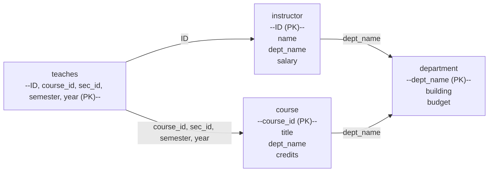

import WordCount from '../../../../src/components/WordCount/WordCount';
import Mermaid from '@theme/Mermaid';


<WordCount>

## 2.1 关系数据库的结构

**关系数据库（relational database）** 由一组**关系（relation）** 构成。数学上，一个关系就是若干**元组（tuple）** 的集合；直观上，把关系想象成一张二维**表**：表的每一行对应一个元组，每一列对应一个**属性（attribute）**。

设 $D_1, D_2, \dots, D_n$ 是 $n$ 个**域（domain）**，一个关系 $r$ 是笛卡儿积 $D_1 \times D_2 \times \dots \times D_n$ 的子集。也就是说，$r \subseteq D_1 \times D_2 \times \dots \times D_n$，其中每个元组 $t = (v_1, v_2, \dots, v_n)$ 满足 $v_i \in D_i$。

以大学示例中的 `instructor` 关系为例：

| ID    | name       | dept\_name | salary |
| ----- | ---------- | ---------- | ------ |
| 10101 | Srinivasan | Comp. Sci. | 65000  |
| 12121 | Wu         | Finance    | 90000  |
| 15151 | Mozart     | Music      | 40000  |
| 22222 | Einstein   | Physics    | 95000  |
| 32343 | El Said    | History    | 60000  |
| 33456 | Gold       | Physics    | 87000  |
| 45565 | Katz       | Comp. Sci. | 75000  |
| 58583 | Califieri  | History    | 62000  |
| 76543 | Singh      | Finance    | 80000  |
| 76766 | Crick      | Biology    | 72000  |

关系有几点重要特性需要牢记：

1. **元组无重复**：因为关系是集合，所有元组两两不同；
2. **元组无序**：行的物理顺序对关系本身没有意义；
3. **属性值原子**：每个 $v_i$ 都是原子的、不可再分（第一范式）；
4. **允许空值**：属性值可以为 `null`，表示"不存在"或"未知"。

**关于空值（null）的说明**：空值给关系代数、SQL 的比较和聚集运算带来复杂性。任何涉及 `null` 的比较结果都是 `unknown`，谓词表达式因此从二值逻辑扩展为**三值逻辑**（`true`, `false`, `unknown`）。`WHERE` 只保留取值为 `true` 的元组；聚集函数（`AVG`、`SUM` 等）默认忽略空值。设计上应尽量给出明确的默认值或明确禁止 `null`，以减少歧义。

---

## 2.2 数据库模式

需要严格区分**模式**与**实例**两个概念：

- **关系模式（relation schema）**：形如 $R(A_1, A_2, \dots, A_n)$，描述关系名及其属性列表和各属性的域；
- **关系实例（relation instance）**：满足模式约束的一个具体元组集合，随时间而变化。

大学数据库的模式可写作：

```
department (dept_name, building, budget)
course     (course_id, title, dept_name, credits)
instructor (ID, name, dept_name, salary)
section    (course_id, sec_id, semester, year, building, room_number, time_slot_id)
teaches    (ID, course_id, sec_id, semester, year)
student    (ID, name, dept_name, tot_cred)
takes      (ID, course_id, sec_id, semester, year, grade)
advisor    (s_ID, i_ID)
prereq     (course_id, prereq_id)
classroom  (building, room_number, capacity)
time_slot  (time_slot_id, day, start_time, end_time)
```

其中带下划线的属性是**主码（primary key）**，例如 `instructor` 的主码为 `ID`。

**多关系例子**：观察 `takes` 与 `student` 的模式。`takes` 存放学生的选课与成绩记录，它的主码由 5 个属性联合构成，反映了业务规则"同一位学生在同一学期同一门课的同一段中至多有一条成绩记录"。属性 `ID` 是 `takes` 到 `student` 的外码，`(course_id, sec_id, semester, year)` 是 `takes` 到 `section` 的外码。这种通过外码互相引用的结构，正是"关系"数据库能表达实体间"联系"的关键。

---

## 2.3 码

**码（key）** 是能够唯一标识元组的属性集合。

- **超码（superkey）**：属性集合 $K \subseteq R$，若对任何合法实例都不存在两个不同元组在 $K$ 上取值相同，则称 $K$ 为 $R$ 的超码；
- **候选码（candidate key）**：极小的超码，即从中去掉任何属性都不再是超码；
- **主码（primary key）**：从候选码中人为选定的一个，用于对元组的唯一命名；
- **外码（foreign key）**：关系 $R_1$ 的某属性集合 $A$ 若引用另一关系 $R_2$ 的主码，则 $A$ 称为 $R_1$ 到 $R_2$ 的外码；此约束称为**参照完整性（referential integrity）**。

例如 `instructor.dept_name` 是外码，它必须出现在 `department.dept_name` 中；`teaches.ID` 是引用 `instructor.ID` 的外码。

**码的例子分析**：以 `classroom(building, room_number, capacity)` 为例：

- $\{\text{building}, \text{room\_number}\}$ 是超码，因为一个具体房间必唯一；
- 它同时是候选码——单独去掉任何一个属性都不再唯一：例如 Watson 楼 100 号与 Packard 楼 100 号是两个不同房间；
- 因此我们选它作主码。加入 `capacity` 后 $\{\text{building}, \text{room\_number}, \text{capacity}\}$ 仍是超码但不再"极小"，因而不是候选码。

**参照完整性上的行为**：当被引用的主码被删除或更新时，DBMS 需要按预设策略处理外码：`CASCADE`（级联删除/更新）、`SET NULL`（置空）、`SET DEFAULT`（置默认值）或`RESTRICT/NO ACTION`（禁止操作）。策略的选择直接影响数据一致性与业务合理性。

---

## 2.4 模式图

**模式图（schema diagram）** 用图形化的方式呈现关系模式及其间的外码约束：每个矩形代表一个关系，矩形内列出所有属性并给主码加下划线；两个关系间从外码属性引出一条箭头指向被引用关系的主码。



模式图直观地揭示了数据库中关系间的联系，是设计和沟通阶段最常用的工具之一。

---

## 2.5 关系查询语言

**查询语言（query language）** 是用户用来从数据库中检索信息的语言。按表达能力和风格可分为：

- **过程式（procedural）**：既指定要什么，也指定如何计算；如**关系代数**；
- **非过程式（non-procedural）**：只指定要什么；如**关系演算**、SQL。

按用途还可分为：

- **纯查询语言（pure）**：仅供理论研究，如关系代数、元组关系演算、域关系演算；
- **商用查询语言（commercial）**：如 SQL，实际系统采用它。

在本章我们重点介绍关系代数——它是理解 SQL、进行查询优化的重要工具。

---

## 2.6 关系代数

**关系代数（relational algebra）** 是一种过程式查询语言。它由一组作用在关系上的运算构成，运算的输入是若干关系，输出仍是关系，因此可以嵌套组合。

基本运算包括：**选择** $\sigma$、**投影** $\pi$、**并** $\cup$、**差** $-$、**笛卡儿积** $\times$、**更名** $\rho$；派生运算包括：**交** $\cap$、**连接** $\bowtie$、**除** $\div$、**赋值** $\leftarrow$。

### 2.6.1 选择运算

**选择运算（selection）** 记为 $\sigma_P(r)$，$P$ 是选择谓词。含义是从 $r$ 中选出使 $P$ 为真的元组：

$$\sigma_P(r) = \{\, t \in r \mid P(t) \,\}$$

例如"物理系工资高于 90000 的教师"：

$$\sigma_{\text{dept\_name}=\text{'Physics'} \,\wedge\, \text{salary} > 90000}(\text{instructor})$$

谓词 $P$ 中可用比较运算符 $=,\neq,<,\le,>,\ge$ 以及布尔连接词 $\wedge,\vee,\neg$。

### 2.6.2 投影运算

**投影运算（projection）** 记为 $\pi_{A_1,A_2,\dots,A_k}(r)$，只保留指定的属性列，重复元组自动去掉。

例："列出所有教师的姓名与工资"：

$$\pi_{\text{name},\, \text{salary}}(\text{instructor})$$

投影运算改变关系的元数（列数），但不改变元组的语义。因为关系是集合，投影后自动消除重复。

### 2.6.3 关系运算的复合

关系代数运算的结果仍是关系，因此可以作为下一个运算的输入。例："物理系教师的姓名"：

$$\pi_{\text{name}}\bigl(\sigma_{\text{dept\_name}='\text{Physics}'}(\text{instructor})\bigr)$$

这种复合能力是关系代数具有"闭包"性质的体现。

### 2.6.4 笛卡儿积运算

**笛卡儿积（Cartesian product）** 记为 $r \times s$，把 $r$ 的每一个元组与 $s$ 的每一个元组"拼接"起来：

$$r \times s = \{\, t \, q \mid t \in r,\; q \in s \,\}$$

若 $r$ 有 $n_r$ 个元组、$s$ 有 $n_s$ 个元组，则 $r \times s$ 恰有 $n_r \cdot n_s$ 个元组。若 $r,s$ 有同名属性，需先更名。笛卡儿积本身用途不大，但它是**连接**的基础。

### 2.6.5 连接运算

**θ-连接（theta-join）** 记为 $r \bowtie_\theta s$，等价于对笛卡儿积施加选择：

$$r \bowtie_\theta s = \sigma_\theta (r \times s)$$

当 $\theta$ 是一组等值条件（且比较的属性同名）时，可去掉重复列，得到**自然连接（natural join）** $r \bowtie s$。

例："列出所有教师所在系的建筑物"：

$$\pi_{\text{name},\, \text{building}}\bigl(\text{instructor} \bowtie \text{department}\bigr)$$

自然连接根据同名属性 `dept_name` 自动做等值匹配。

### 2.6.6 集合运算

- **并** $r \cup s$：出现于 $r$ 或 $s$ 中的元组；
- **交** $r \cap s$：同时出现的元组；
- **差** $r - s$：出现于 $r$ 但不出现于 $s$ 的元组。

集合运算要求两个关系**并相容（union-compatible）**：元数相同，对应属性同域。

例："既是教师又是学生的人"（假设 `instructor.ID` 与 `student.ID` 均取值于同一域）：

$$\pi_{\text{ID}}(\text{instructor}) \,\cap\, \pi_{\text{ID}}(\text{student})$$

再看两个查询：

- "在 2018 秋季或 2019 春季开课的课程号"：

$$\pi_{\text{course\_id}}\bigl(\sigma_{\text{semester}='\text{Fall}' \wedge \text{year}=2018}(\text{section})\bigr) \cup \pi_{\text{course\_id}}\bigl(\sigma_{\text{semester}='\text{Spring}' \wedge \text{year}=2019}(\text{section})\bigr)$$

- "在 2018 秋季开课但未在 2019 春季开课的课程号"：

$$\pi_{\text{course\_id}}\bigl(\sigma_{\text{semester}='\text{Fall}' \wedge \text{year}=2018}(\text{section})\bigr) \; - \; \pi_{\text{course\_id}}\bigl(\sigma_{\text{semester}='\text{Spring}' \wedge \text{year}=2019}(\text{section})\bigr)$$

集合运算与选择运算配合，可以表达大量"存在/不存在"类查询。

### 2.6.7 赋值运算

**赋值运算** $\leftarrow$ 把一个表达式的结果暂存到一个临时关系中，便于分步编写：

$$\text{temp1} \leftarrow \sigma_{\text{dept\_name}='\text{Physics}'}(\text{instructor})$$
$$\text{result} \leftarrow \pi_{\text{name}}(\text{temp1})$$

赋值不增加表达能力，只是提高可读性。

### 2.6.8 更名运算

**更名运算（rename）** 记为 $\rho_x(E)$：把表达式 $E$ 的结果关系命名为 $x$；也可写作 $\rho_{x(A_1,\dots,A_n)}(E)$ 同时给属性重命名。

自连接必须先更名。例："列出比 Einstein 工资高的教师姓名"：

$$\rho_e(\text{instructor}) \times \rho_t(\text{instructor})$$

$$\pi_{t.\text{name}}\bigl(\sigma_{t.\text{salary} > e.\text{salary} \,\wedge\, e.\text{name}='\text{Einstein}'}(\rho_e(\text{instructor}) \times \rho_t(\text{instructor}))\bigr)$$

### 2.6.9 等价查询

同一个查询往往有多种等价的关系代数表达式。等价变换是**查询优化**的基础，常用规则举例：

- 选择的**下推（pushing selection）**：$\sigma_\theta(r \bowtie s) \equiv \sigma_\theta(r) \bowtie s$（当 $\theta$ 只涉及 $r$ 的属性时）；
- 投影的下推：$\pi_L(\sigma_\theta(r)) \equiv \sigma_\theta(\pi_L(r))$（当 $L$ 包含 $\theta$ 用到的所有属性时）；
- 选择的**交换律**：$\sigma_{\theta_1}(\sigma_{\theta_2}(r)) \equiv \sigma_{\theta_2}(\sigma_{\theta_1}(r))$；
- 连接的交换律与结合律：$r \bowtie s \equiv s \bowtie r$；$(r \bowtie s) \bowtie t \equiv r \bowtie (s \bowtie t)$。

优化器利用这些等价规则寻找代价最低的执行计划。

**优化示例**：考虑查询"物理系教师所教的课程 title"。朴素表达：

$$\pi_{\text{title}}\bigl(\sigma_{\text{dept\_name}='\text{Physics}'}(\text{instructor} \bowtie \text{teaches} \bowtie \text{course})\bigr)$$

三张表全部笛卡儿积再筛选，代价极高。做选择下推：

$$\pi_{\text{title}}\bigl(\bigl(\sigma_{\text{dept\_name}='\text{Physics}'}(\text{instructor})\bigr) \bowtie \text{teaches} \bowtie \text{course}\bigr)$$

选择先把 `instructor` 缩小到物理系（大概只有几行），再依次与 `teaches`、`course` 连接，效率显著提升。这也是关系代数与 SQL 查询优化器的核心思想。

**扩展运算简介**：除基本运算外，实际系统还支持

- **外连接（outer join）** $\bowtie\!\!\!\!\!\!\!\!\!\;\;\text{L}$、$\bowtie\!\!\!\!\!\!\!\!\!\;\;\text{R}$、$\bowtie\!\!\!\!\!\!\!\!\!\;\;\text{F}$：保留一端或两端未匹配的元组，未匹配的对应列填 `null`；用于避免"丢行"；
- **聚集函数** $\mathcal{G}$：如 $_{\text{dept\_name}}\mathcal{G}_{\text{avg}(\text{salary})}(\text{instructor})$ 按系分组求平均工资；
- **分组去重**：与 SQL 的 `GROUP BY`、`HAVING`、`DISTINCT` 对应。

这些扩展显著增强了关系代数的表达力，使之贴近 SQL 实际能力。

---

## 2.7 总结

- 关系数据库由若干关系构成，关系是元组的集合，模式描述结构，实例描述内容；
- 码用于唯一标识元组，外码用于表达关系间的引用；参照完整性是最基本的完整性约束；
- 模式图是描绘关系模式与外码约束的常用工具；
- 关系代数是过程式查询语言，六个基本运算 $\sigma, \pi, \cup, -, \times, \rho$ 可导出其他所有运算；
- 关系代数表达式的等价变换构成了查询优化的理论基础，SQL 查询最终都可转换为关系代数以便系统进行代价估计与执行。

后续第 3 章 (E-R 模型) 将从"如何设计出高质量的关系模式"入手；第 4 章 (关系数据库设计) 则在此基础上讨论函数依赖与范式理论。

</WordCount>
