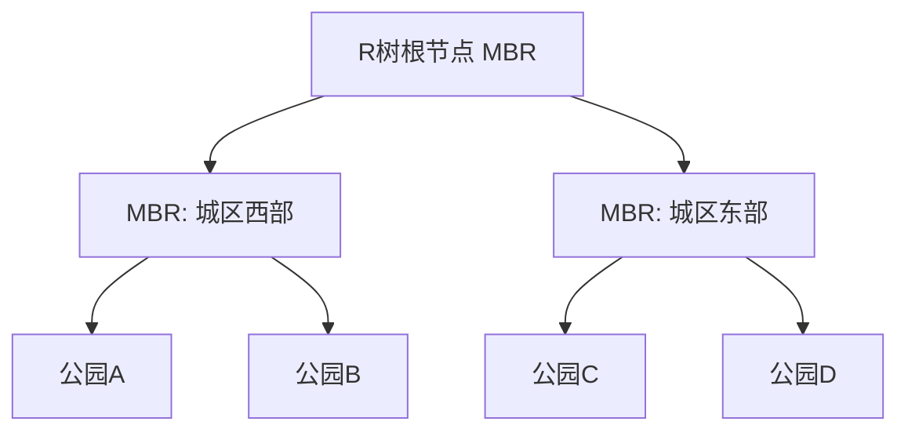

import WordCount from '../../../../src/components/WordCount/WordCount';
import Mermaid from '@theme/Mermaid';

<WordCount>

## 8.1 半结构化数据

传统关系模型要求每个元组都严格符合表的模式（schema）：列的数量、名称、数据类型都是预先固定的。这种「刚性模式」在企业级事务处理中带来极大好处，但在 Web、日志、传感器、社交等场景中会遇到问题：数据的结构差异极大，字段可能缺失、嵌套、重复，模式经常演化。为此，数据库社区引入了 **半结构化数据（semi-structured data）** 模型，它介于纯结构化的关系数据与完全无结构的文本之间。

### 8.1.1 半结构化数据模型概述

半结构化数据的主要特点可以概括为四点：

1. **自描述**：数据与其结构标签放在一起，读者无须外部模式即可解释其含义。
2. **模式灵活**：同一集合中的记录允许字段缺失或多余；模式可随时间演化。
3. **嵌套结构**：字段值本身可以是集合、数组或子对象，突破了 1NF 的原子性限制。
4. **模式可选**：可以完全不给模式，也可以用 JSON Schema、XML Schema 等外挂式约束。

半结构化数据模型追求「先存进来，再谈结构」（schema on read），与关系模型的「先建结构，再存数据」（schema on write）形成对比。它牺牲了一部分查询效率与完整性约束，换来了对异构数据源的宽容和扩展的敏捷。

### 8.1.2 JSON

**JSON（JavaScript Object Notation）** 已成为 Web 与移动 API 事实上的数据交换格式。它只有六种基本类型：字符串、数字、布尔、null、数组 `[]` 和对象 `{}`，其中数组和对象可任意嵌套。

一份典型的图书 JSON 记录：

```json
{
  "ISBN": "0-13-500323-9",
  "title": "Database System Concepts",
  "authors": ["Silberschatz", "Korth", "Sudarshan"],
  "edition": 7,
  "publisher": {
    "name": "McGraw-Hill",
    "location": "New York"
  },
  "prices": [
    { "currency": "USD", "amount": 210.0 },
    { "currency": "CNY", "amount": 128.0 }
  ],
  "translations": null
}
```

现代 SQL 系统（PostgreSQL、Oracle、SQL Server、MySQL）都提供了原生的 `JSON`/`JSONB` 类型，可以在关系表的一列中存放 JSON 文档，并使用路径表达式访问其内部：

```sql
-- PostgreSQL 风格
SELECT b.doc ->> 'title'                    AS title,
       b.doc -> 'authors' ->> 0             AS first_author,
       (b.doc -> 'prices' -> 0 ->> 'amount')::numeric AS usd_price
FROM   books b
WHERE  b.doc @> '{"edition": 7}';
```

同类专门数据库如 MongoDB 直接把 JSON（准确地说是 BSON）当作首要存储单元，用 `db.books.find({edition:7})` 完成同样的查询。

### 8.1.3 XML

**XML（eXtensible Markup Language）** 出现比 JSON 更早，语法上更冗长，但表达能力也更强：它允许属性、命名空间、混合内容（文本与子元素交错）、DTD/XSD 模式约束，广泛用于文档、SOAP、金融报文、政府开放数据。

同一本书的 XML 表示：

```xml
<book isbn="0-13-500323-9">
  <title lang="en">Database System Concepts</title>
  <authors>
    <author>Silberschatz</author>
    <author>Korth</author>
    <author>Sudarshan</author>
  </authors>
  <edition>7</edition>
  <publisher>
    <name>McGraw-Hill</name>
    <location>New York</location>
  </publisher>
</book>
```

XML 查询主要靠两种语言：

- **XPath**：像目录路径一样定位节点，例如 `/book/authors/author[1]` 取第一作者。
- **XQuery**：SQL 之于关系的地位，XQuery 之于 XML，它支持 FLWOR（For-Let-Where-Order-Return）表达式：

```xquery
for $b in doc("books.xml")//book
where $b/edition >= 7
return <t>{ $b/title/text() }</t>
```

### 8.1.4 RDF和知识图谱

**RDF（Resource Description Framework）** 使用「主-谓-宾」三元组描述任意实体之间的关系，是语义 Web 和知识图谱的基础。三元组通常以 URI 标识资源，字面量作为值。Turtle 语法示例：

```turtle
@prefix ex: <http://example.org/> .
@prefix rdf: <http://www.w3.org/1999/02/22-rdf-syntax-ns#> .

ex:book_dsc  rdf:type          ex:Book ;
             ex:title          "Database System Concepts" ;
             ex:hasAuthor      ex:silberschatz , ex:korth , ex:sudarshan ;
             ex:edition        7 .

ex:silberschatz  rdf:type   ex:Person ;
                 ex:name    "Abraham Silberschatz" ;
                 ex:worksAt ex:yale .
```

**SPARQL** 是 RDF 的查询语言，模式匹配非常自然：

```sparql
SELECT ?title ?author WHERE {
  ?b ex:title ?title ;
     ex:hasAuthor ?a .
  ?a ex:name ?author .
}
```

RDF 与图数据库结合，便得到「知识图谱」：Google Knowledge Graph、Wikidata、DBpedia 都以数十亿条三元组为核心，为搜索、问答、推荐提供背景知识。

---

## 8.2 面向对象

早期关系模型偏向数值与短字符串，遇到 CAD 图形、多媒体、地理坐标、复杂业务对象等场景时显得力不从心：字段类型不够、缺少继承、缺少方法。20 世纪 90 年代出现了两条路线——面向对象数据库（OODB）与在关系数据库中扩展面向对象特性（对象-关系数据库，ORDBMS）。

### 8.2.1 对象-关系数据库系统

对象-关系数据库（如 PostgreSQL、Oracle）在保留 SQL 的同时增加了以下能力：

- **复合类型（结构体）**：`CREATE TYPE Address AS (street VARCHAR, city VARCHAR, zip VARCHAR);`
- **集合类型**：数组、多重集合、`ARRAY`、`MULTISET`。
- **继承与子表**：`CREATE TABLE Student ( ... ) INHERITS (Person);`
- **引用类型（`REF`）**：一个元组可以指向另一个元组，避免额外连接。
- **用户自定义函数与方法**：把行为封装到类型中。

例如定义一个「书」类型并用作列的域：

```sql
CREATE TYPE Book_t AS (
  isbn      CHAR(13),
  title     VARCHAR(200),
  authors   VARCHAR(100) ARRAY[10],
  price     NUMERIC(8,2)
);

CREATE TABLE library (b Book_t, shelf INT);
SELECT (b).title FROM library WHERE (b).price < 100;
```

### 8.2.2 对象-关系映射

工业界更常见的做法是 **ORM（Object-Relational Mapping）**：应用程序保持面向对象，底层仍用普通关系表，靠中间层做双向翻译。经典实现如 Java 的 Hibernate/JPA、Python 的 SQLAlchemy/Django ORM、C# 的 Entity Framework。

以 JPA 为例：

```java
@Entity
@Table(name = "students")
public class Student {
    @Id private Long id;
    private String name;
    @ManyToMany
    @JoinTable(name = "takes",
        joinColumns = @JoinColumn(name = "student_id"),
        inverseJoinColumns = @JoinColumn(name = "course_id"))
    private List<Course> courses;
}
```

ORM 让开发者以「对象、方法、集合」的方式思考，代价是查询可能被翻译成低效 SQL、N+1 问题突出、复杂报表仍需手写 SQL。因此，掌握底层关系模型仍是必要的。

---

## 8.3 文本数据

大量业务数据以自由文本形式存在：邮件、评论、新闻、日志、代码注释。文本检索不同于精确匹配的关系查询——用户希望「查找与关键字相关的文档」，并按相关性排序。

### 8.3.1 关键字查询

**倒排索引（inverted index）** 是文本检索的基石：为每个词维护一个「出现该词的文档 ID 列表」（posting list）。查询「database concepts」会取出两个 posting list 求交或求并。为提高效果，索引前通常要做：

- **分词**：中文用 Jieba、IK；英文按空格与标点。
- **去停用词**：`the, a, is, 的, 了` 等高频虚词。
- **词干还原（stemming/lemmatization）**：`running → run`，`分析着 → 分析`。

SQL 中可以用 `LIKE '%keyword%'`，但不走索引；专业做法是使用全文索引：PostgreSQL 的 `tsvector`/`tsquery`、MySQL `FULLTEXT`、Elasticsearch 独立系统。

### 8.3.2 相关性排名

信息检索中最经典的相关性打分是 **TF-IDF**：

$$
w_{t,d} = \mathrm{tf}(t,d) \cdot \log \frac{N}{\mathrm{df}(t)}
$$

其中 $\mathrm{tf}(t,d)$ 是词 $t$ 在文档 $d$ 中的出现次数，$\mathrm{df}(t)$ 是包含 $t$ 的文档数，$N$ 是文档总数。文档与查询的相关度用向量空间的余弦相似度衡量。工业界更常用改进版 **BM25**，它对词频做饱和处理，对长文档做长度惩罚。

### 8.3.3 检索有效性的度量

对给定查询，设 R 为相关文档集合，A 为系统返回的文档集合：

- **查准率（Precision）** = $|R \cap A|/|A|$
- **查全率（Recall）** = $|R \cap A|/|R|$
- **F1** = $2PR/(P+R)$

在 Top-K 场景下常用 **P@K、MAP、nDCG** 等指标，衡量前若干条结果的质量。

### 8.3.4 结构化数据和知识图谱上的关键字查询

用户希望像用 Google 一样查询数据库——直接输入关键字，不写 SQL。此时系统需要：

1. 把关键字映射到表、列、行的候选实体。
2. 在实体之间寻找连接路径（外键、图边）。
3. 按路径长度、频次、重要性给候选答案打分。

在知识图谱上，这被称为**关键字子图查询**或**语义查询**：给定关键字集合，寻找将它们全部覆盖的最小连通子图，是子图寻径与 Steiner 树问题的实际应用。

---

## 8.4 空间数据

**空间数据（spatial data）** 描述几何形状及其在空间中的位置：GIS 地图、CAD 图纸、医疗影像分割、无人驾驶点云、室内定位。它对数据库提出了两个特殊需求：几何数据类型 + 空间索引。

### 8.4.1 几何信息表示

OGC（开放地理空间联盟）标准定义了如下核心几何类型：

- **Point**：`POINT(x y)`
- **LineString**：`LINESTRING(x1 y1, x2 y2, ...)`
- **Polygon**：`POLYGON((x1 y1, ..., x1 y1))`（首尾点相同以闭合）
- **MultiPoint / MultiLineString / MultiPolygon**：集合
- **GeometryCollection**：混合集合

PostGIS 中：

```sql
CREATE TABLE parks (
  id     SERIAL PRIMARY KEY,
  name   TEXT,
  shape  GEOMETRY(Polygon, 4326)
);

SELECT name, ST_Area(shape) FROM parks
WHERE  ST_Contains(shape, ST_MakePoint(116.39, 39.91));
```

### 8.4.2 设计数据库

空间数据库设计既包含逻辑层（实体-属性-空间字段的建模），也包含物理层（如何为空间字段建立索引）。核心工具是 **R 树** 及其变体（R*、R+）——一棵平衡多叉树，每个内部节点存放子树包围盒（MBR，minimum bounding rectangle）。查询窗口先与包围盒做粗筛，再对候选做精确判断。



对于最近邻查询，另一种常用结构是 **Voronoi 图**：给定点集 $P$，将平面划分为若干区域，每个区域内的点距离对应 $p_i$ 最近。Voronoi 图与其对偶的 **Delaunay 三角剖分** 广泛用于最近邻搜索、路径规划、无线网络覆盖分析。

### 8.4.3 地理数据

地理数据的特殊性在于地球是一个球体（准确地说是椭球体）：

- **地理坐标**：经度、纬度，常用 WGS84（EPSG:4326）。
- **投影坐标**：把球面投影到平面，如 Web 墨卡托（EPSG:3857）、UTM 分带。
- **距离**：跨度大时需用大圆距离（Haversine 公式），小尺度可近似为欧氏距离。
- **拓扑关系**：相邻、包含、跨越等（DE-9IM 模型）。

### 8.4.4 空间查询

空间查询主要有以下模式：

| 查询类型 | 例子 | SQL 谓词 |
| --- | --- | --- |
| 点定位（Point Location） | 用户在哪个行政区 | `ST_Contains(area, point)` |
| 范围查询（Range Query） | 距我 1 km 内的餐厅 | `ST_DWithin(loc, point, 1000)` |
| 最近邻查询（k-NN） | 最近 5 个加油站 | `ORDER BY loc <-> point LIMIT 5` |
| 空间连接（Spatial Join） | 所有穿过河流的道路 | `ST_Intersects(road, river)` |

优化的关键在于让 R 树承担粗过滤，把精确几何判定的次数降到最小。

---

## 8.5 总结

- 半结构化数据模型（JSON、XML、RDF）以自描述、模式灵活、嵌套结构应对异构数据场景，是 Web、日志、知识图谱的天然表示。
- 面向对象数据库和对象-关系映射（ORM）连接了对象编程与关系存储，兼顾表达力与工程习惯，但仍要理解底层关系模型以避免性能陷阱。
- 文本数据借助倒排索引、TF-IDF 与 BM25 完成关键字检索，查准率/查全率与 nDCG 用于评估检索质量。
- 空间数据由 OGC 几何类型描述、R 树索引加速，配合 Voronoi 图完成最近邻分析，是 GIS 与位置服务的基石。
- 复杂数据类型让数据库从「表格存储」进一步走向「万物存储」，其代价是查询模型和索引结构更加多样，也促使数据库系统与信息检索、图计算、机器学习深度融合。

</WordCount>
