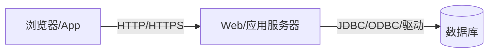
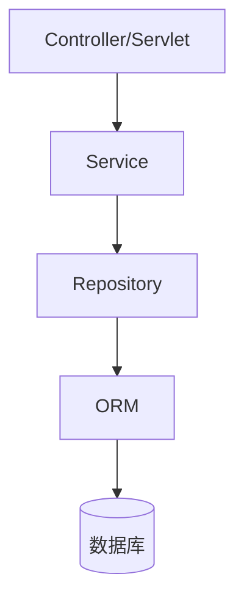

import WordCount from '../../../../src/components/WordCount/WordCount';
import Mermaid from '@theme/Mermaid';

<WordCount>


## 9.1 应用程序和用户界面

一个典型的现代数据库应用由三层构成：

- **表示层（Presentation Layer）**：面向用户的界面，可能是浏览器网页、桌面客户端或移动 App。
- **业务逻辑层（Business Logic Layer）**：处理业务规则、事务、鉴权、审计等。
- **数据管理层（Data Layer）**：数据库系统本身，负责存储、索引、事务与并发控制。

这种分层被称作 **三层架构（three-tier architecture）**：



分层的好处是解耦：界面可以随时替换，业务逻辑可以复用于多个入口，数据库可以独立扩展。相应地，程序员需要理解跨层通信（协议、序列化、事务边界）与安全边界（哪一层信任哪一层）。

---

## 9.2 Web基础

### 9.2.1 统一资源定位符

**URL（Uniform Resource Locator）** 是 Web 上资源的地址，其一般格式：

```
scheme://host[:port]/path?query#fragment
例如：https://library.example.com:443/books?id=42&lang=zh#preface
```

- `scheme`：协议，如 `http`、`https`、`ftp`。
- `host`/`port`：服务器域名与端口。
- `path`：服务器上的资源路径。
- `query`：查询字符串，由 `key=value` 对组成，以 `&` 分隔。
- `fragment`：客户端锚点，服务器一般不接收。

服务器端可以把 URL 视作对某种「资源」的操作，配合 HTTP 动词（GET、POST、PUT、DELETE）构成 REST 风格接口。

### 9.2.2 超文本标记语言

**HTML（HyperText Markup Language）** 描述文档结构，配合 CSS 描述样式、JavaScript 实现交互。一个包含表单的极简页面：

```html
<!DOCTYPE html>
<html>
<body>
  <form action="/login" method="post">
    <input name="user"     type="text" />
    <input name="password" type="password" />
    <button>登录</button>
  </form>
</body>
</html>
```

浏览器提交表单时，会把字段以 `application/x-www-form-urlencoded` 或 `multipart/form-data` 编码送到服务器，服务器解析后交给业务逻辑处理。

### 9.2.3 Web服务器和会话

HTTP 本身是**无状态**的：每次请求之间服务器不记得客户端是谁。为了在多次请求间维持登录、购物车等状态，Web 引入 **Cookie + Session** 机制：

1. 用户第一次访问时，服务器生成一个 `sessionId`，以 `Set-Cookie` 头返回给浏览器。
2. 浏览器随后的每次请求都会在 `Cookie` 头带上这个 `sessionId`。
3. 服务器根据 `sessionId` 从内存/Redis/数据库中查回该用户的会话状态。

现代分布式系统更倾向 **无状态令牌（JWT）**：把用户身份签名加密后放在 Cookie 或 `Authorization: Bearer ...` 头里，服务器只需验签而无需集中存储。

---

## 9.3 servlet

**Servlet** 是 Java Web 服务器端组件规范。一个 Servlet 就是一个继承自 `HttpServlet` 的类，容器（Tomcat、Jetty）负责监听 HTTP 端口、解析请求、调用 `doGet`/`doPost` 方法、返回响应。

### 9.3.1 servlet示例

以下 Servlet 从数据库读取书目并输出 HTML：

```java
@WebServlet("/books")
public class BookServlet extends HttpServlet {
    @Override
    protected void doGet(HttpServletRequest req, HttpServletResponse resp)
            throws IOException, ServletException {
        String kw = req.getParameter("kw");
        resp.setContentType("text/html; charset=utf-8");
        try (Connection c = DataSourceHolder.get().getConnection();
             PreparedStatement ps = c.prepareStatement(
                 "SELECT title, author FROM books WHERE title LIKE ?")) {
            ps.setString(1, "%" + kw + "%");
            try (ResultSet rs = ps.executeQuery();
                 PrintWriter out = resp.getWriter()) {
                out.println("<ul>");
                while (rs.next()) {
                    out.printf("<li>%s — %s</li>%n",
                        escape(rs.getString("title")),
                        escape(rs.getString("author")));
                }
                out.println("</ul>");
            }
        } catch (SQLException e) {
            throw new ServletException(e);
        }
    }
}
```

注意两点：查询用 `PreparedStatement` 而非字符串拼接（对抗 SQL 注入），输出用 `escape` 做 HTML 转义（对抗 XSS）。

### 9.3.2 servlet会话

Servlet 容器提供 `HttpSession` 抽象来维护会话状态：

```java
HttpSession session = req.getSession(true); // 若无则创建
User user = (User) session.getAttribute("user");
if (user == null) {
    resp.sendRedirect("/login");
    return;
}
```

底层由容器生成 `JSESSIONID` 写入 Cookie；服务器一般把会话对象放在内存中，多节点部署时需要粘性会话或分布式 Session 存储。

### 9.3.3 servlet的生命周期

容器管理 Servlet 的四个阶段：

1. **加载**：容器读取 `web.xml` 或 `@WebServlet` 注解，加载类。
2. **初始化**：调用 `init(ServletConfig)`，一般在这里建立数据库连接池、缓存、监控器。
3. **服务**：并发调用 `service()` → `doGet/doPost`；每个请求都在独立线程中执行，因此实例字段必须线程安全。
4. **销毁**：容器关闭或热部署时调用 `destroy()`，释放资源。

### 9.3.4 应用服务器

**应用服务器（application server）** 在 Servlet 容器之上提供事务、消息、连接池、EJB、集群、监控等企业级能力，例如 WildFly（JBoss）、WebLogic、WebSphere。轻量级替代品 Tomcat + Spring Boot 已成为主流选择：把功能集成到进程内，容器只需要一个 JAR。

---

## 9.4 可选择的服务器端框架

### 9.4.1 服务器端脚本

早期动态网页使用**服务器端脚本**：把代码直接嵌入 HTML，服务器解析后返回渲染结果。PHP、JSP、ASP、Python 的 Jinja/Django 模板都属于此类：

```jsp
<ul>
<% for (Book b : books) { %>
  <li><%= b.getTitle() %></li>
<% } %>
</ul>
```

优点是入门门槛低、局部改动无需重启；缺点是逻辑与视图容易缠绕，难以单元测试。

### 9.4.2 Web应用框架

Web 应用框架把常见需求（路由、模板、表单校验、认证、ORM、数据库迁移）打包成可组合的库或规范，让开发者聚焦业务。代表性框架有：

- Java：Spring Boot、Jakarta EE、Play。
- Python：Django、Flask、FastAPI。
- Ruby：Ruby on Rails。
- JavaScript：Express、NestJS、Next.js。
- Go：Gin、Echo。

### 9.4.3 Django框架

以 Django 为例，其核心是 **MTV（Model-Template-View）** 模式：

```python
# models.py
class Book(models.Model):
    title  = models.CharField(max_length=200)
    author = models.CharField(max_length=100)

# views.py
def book_list(request):
    kw = request.GET.get("kw", "")
    books = Book.objects.filter(title__icontains=kw)
    return render(request, "books.html", {"books": books})

# urls.py
urlpatterns = [ path("books/", views.book_list) ]
```

Django 自动生成后台管理界面、自带 CSRF 保护、支持数据库迁移和多种缓存后端，是「电池全齐」（batteries included）的典范。

---

## 9.5 客户端代码和Web服务

### 9.5.1 JavaScript

**JavaScript** 是浏览器唯一的原生脚本语言，负责 DOM 操作、事件处理、异步通信。现代前端框架 React、Vue、Angular 把它推向工程化：组件、状态管理、虚拟 DOM。基础的异步请求例子：

```javascript
async function loadBooks(kw) {
  const resp = await fetch(`/api/books?kw=${encodeURIComponent(kw)}`);
  const data = await resp.json();
  document.querySelector('#list').innerHTML =
    data.map(b => `<li>${escapeHtml(b.title)}</li>`).join('');
}
```

### 9.5.2 Web服务

Web 服务是可通过网络调用的接口，主要两种风格：

- **SOAP**：基于 XML + WSDL 描述，重型、强类型。
- **REST**：基于 HTTP 动词与 URL 路径，用 JSON 作为负载，轻量、易于跨语言。
- **GraphQL**：客户端声明所需字段，服务器按需拼装，减少多次往返。

一个 RESTful 接口示例：

| 方法 | 路径 | 语义 |
| --- | --- | --- |
| GET | `/books` | 列表 |
| GET | `/books/{id}` | 详情 |
| POST | `/books` | 新建 |
| PUT | `/books/{id}` | 全量更新 |
| DELETE | `/books/{id}` | 删除 |

### 9.5.3 断连操作

移动网络时常不稳定，客户端需要支持**断连操作（disconnected operation）**：本地缓存数据、本地记录变更队列、在网络恢复时同步。技术手段包括 Service Worker、IndexedDB、乐观 UI、冲突解决（Last-Write-Wins、CRDT）。

### 9.5.4 移动应用平台

移动开发有三条路线：

- **原生**（iOS Swift/Objective-C，Android Kotlin/Java）：性能最好，成本最高。
- **跨平台原生**：React Native、Flutter，一套代码接近原生体验。
- **PWA（Progressive Web App）**：以 Web 技术包装的应用，可离线、可安装。

三者都依赖后端 REST/GraphQL 服务与数据库，客户端与数据库不直接通信。

---

## 9.6 应用程序体系结构

### 9.6.1 业务逻辑层

业务逻辑层负责实现真正的业务规则：转账、下单、审批、库存扣减。它通常被组织成若干**服务（service）**，服务内部使用**领域对象（domain object）** 建模业务概念，靠**仓储（repository）** 隔离数据访问：



事务边界通常落在 Service 层：一个业务方法一个事务，保证若干次数据库调用要么全成功、要么全失败。

### 9.6.2 数据访问层和对象-关系映射

数据访问层封装了对底层数据库的所有调用，避免业务代码直接书写 SQL。典型技术包括 JDBC/DAO、MyBatis、Hibernate/JPA、SQLAlchemy、Prisma。选择 ORM 时要权衡：

- 优点：类型安全、写少读多的开发效率、方言可移植、自动缓存。
- 缺点：复杂查询表达受限、N+1 查询问题、隐藏性能陷阱。

工程上常见的折中：简单 CRUD 用 ORM，复杂报表用手写 SQL 或视图。

---

## 9.7 应用程序性能

### 9.7.1 通过高速缓存减少开销

缓存是提升 Web 应用性能最直接的手段，可以分层部署：

- **浏览器缓存**：`Cache-Control`、ETag、Service Worker。
- **CDN 缓存**：静态资源、可公开缓存的 API 响应。
- **反向代理缓存**：Varnish、Nginx。
- **应用层缓存**：进程内 LRU、分布式缓存 Redis/Memcached。
- **查询结果缓存**：数据库或 ORM 自身。

要点是**命中率**与**一致性**的取舍：TTL、显式失效、写穿透（write-through）、写回（write-back）、Cache Aside 等模式各有适用。

### 9.7.2 并行处理

现代服务器都是多核，处理并发请求靠：

- **多线程 / 多进程**：Servlet 容器为每个请求分配线程池。
- **异步 I/O**：Node.js、Netty、Vert.x、asyncio 用少量线程支撑高并发。
- **消息队列**：把耗时任务（发信、生成报表）异步化，解耦生产与消费。
- **数据库层并行**：分片、读写分离、并行查询。

程序员需要意识到并发写入带来的一致性问题——事务、乐观锁、幂等键、消息去重都是必备工具。

---

## 9.8 应用程序安全性

安全是应用开发的底线。本节列举最常见的攻击面与对策。

### 9.8.1 SQL注入

**SQL 注入**指攻击者把恶意 SQL 片段拼进应用查询中。以下是**反面例子**：

```java
// 危险：直接字符串拼接
String user = req.getParameter("user");
String pwd  = req.getParameter("pwd");
String sql  = "SELECT * FROM users " +
              "WHERE name='" + user + "' AND pwd='" + pwd + "'";
Statement st = conn.createStatement();
ResultSet rs = st.executeQuery(sql);
```

只要在 `user` 输入框填 `admin' --`，最终 SQL 就变成：

```sql
SELECT * FROM users WHERE name='admin' --' AND pwd='xxx'
```

`--` 使得密码判定被注释掉，攻击者以任意用户身份登录。更危险的 payload 甚至能 `DROP TABLE users`。

**正确写法**：使用参数化查询（`PreparedStatement`），把用户输入作为参数值绑定，而非拼接到 SQL 文本中：

```java
String sql = "SELECT id FROM users WHERE name = ? AND pwd_hash = ?";
try (PreparedStatement ps = conn.prepareStatement(sql)) {
    ps.setString(1, user);
    ps.setString(2, hash(pwd));
    try (ResultSet rs = ps.executeQuery()) {
        if (rs.next()) { /* 登录成功 */ }
    }
}
```

除此之外还应遵循：最小权限的数据库账号、白名单校验、ORM 使用命名参数、动态 SQL 走安全的模板系统。

### 9.8.2 跨站点脚本和请求伪造

**XSS（Cross-Site Scripting）** 指攻击者把脚本注入到网页中，被其他用户浏览器执行。反面例子：

```jsp
<!-- 危险：直接输出用户提交的内容 -->
<div>${comment}</div>
```

如果 `comment` 是 `<script>fetch('/steal?c='+document.cookie)</script>`，其他访问者的 Cookie 就会被送到攻击者服务器。

**修复**：所有输出到 HTML 的用户内容都要转义：

```html
<!-- 转义后 -->
<div>&lt;script&gt;fetch('/steal?c='+document.cookie)&lt;/script&gt;</div>
```

即：`<` → `&lt;`，`>` → `&gt;`，`"` → `&quot;`，`'` → `&#39;`，`&` → `&amp;`。多数模板引擎默认自动转义，仅当明确输出 HTML 时才 opt-out。

**CSRF（Cross-Site Request Forgery）** 指攻击者诱导已登录用户的浏览器向目标站点发起伪造请求。防御手段包括：CSRF Token、`SameSite=Lax/Strict` Cookie、检查 `Origin`/`Referer`、对高危操作要求二次确认。

### 9.8.3 密码泄露

存储密码的黄金法则：**永远不要以明文或可逆加密保存密码**。正确做法：

1. 生成随机 **盐（salt）**，每个用户一份。
2. 使用为密码专门设计的慢哈希函数：**bcrypt / scrypt / Argon2 / PBKDF2**，将 `salt + password` 反复散列（工作因子 10~14）。
3. 存储 `algo | salt | hash` 组合，不存原文。

```java
// 使用 jBCrypt
String hash = BCrypt.hashpw(password, BCrypt.gensalt(12));
// 验证
boolean ok = BCrypt.checkpw(inputPassword, storedHash);
```

慢哈希函数的存在是为了让暴力破解和彩虹表都不可行——即使数据库泄露，攻击者仍需巨额算力才能反推密码。

### 9.8.4 应用级认证

认证（authentication）回答「你是谁」。常见形态：

- 用户名+密码 + 慢哈希。
- 多因素认证（MFA）：短信、TOTP、硬件密钥（FIDO2/WebAuthn）。
- 单点登录（SSO）：SAML、OAuth 2.0、OpenID Connect。
- 无密码登录：邮箱魔法链接、Passkey。

### 9.8.5 应用级授权

授权（authorization）回答「你能做什么」。常见模型：

- **RBAC（角色-访问控制）**：用户 → 角色 → 权限。
- **ABAC（属性-访问控制）**：基于用户、资源、环境属性动态判定。
- **ACL（访问控制列表）**：每个资源维护允许的用户/组列表。

数据库自身也提供 GRANT/REVOKE 与行级安全（RLS）来配合应用层授权，做纵深防御。

### 9.8.6 审计追踪

**审计追踪（audit trail）** 记录谁在什么时间对什么数据做了什么操作。既满足合规（SOX、等保、GDPR），也是发生安全事件后取证的关键。实现方式包括应用日志、数据库触发器、CDC（变更数据捕获）、专门的审计表。审计日志本身要防篡改：追加式存储、加密签名、异地备份。

### 9.8.7 隐私

隐私保护要考虑最小采集、最小可见、匿名化、脱敏、数据留存期限。技术工具包括数据分类、字段级加密、差分隐私、k-匿名化。GDPR、CCPA、《个人信息保护法》都对应用如何存储和使用个人信息提出了硬性要求。

---

## 9.9 加密及其应用

### 9.9.1 加密技术

- **对称加密**：加解密使用同一密钥，速度快，适合大数据量。代表算法 AES-256、ChaCha20。
- **非对称加密**：公钥加密、私钥解密（或反之用于签名）。代表算法 RSA、ECC。
- **哈希函数**：单向、抗碰撞。SHA-256、SHA-3、BLAKE2。
- **消息认证码（MAC）**：HMAC-SHA256 保证完整性与真实性。
- **密钥交换**：Diffie-Hellman、ECDH。

真实系统常用**混合加密**：非对称交换会话密钥，对称密钥加密数据，这也是 TLS 的核心思想。

### 9.9.2 数据库中的加密支持

- **传输层加密**：客户端 ↔ 数据库间使用 TLS。
- **存储层加密**：TDE（透明数据加密），文件级/表空间级，磁盘失窃时保护数据。
- **字段级加密**：把敏感列（身份证、手机号）用应用密钥加密后存入数据库。
- **可搜索加密**：允许在密文上做等值匹配的确定性加密，或范围查询的保序加密（有安全权衡）。
- **同态加密 / 安全多方计算**：允许在密文上直接计算，是研究热点。

### 9.9.3 加密和认证

加密与认证经常配合使用：

- HTTPS = HTTP + TLS：既加密传输，也用证书认证服务器。
- 数字签名：私钥签、公钥验，保证数据来源与完整性。
- 证书链与 PKI：由可信 CA 组成信任链，浏览器与操作系统内置根证书。

程序员应尽量使用成熟库（OpenSSL、libsodium、JCA）而不是自造加密算法——密码学的安全不在算法本身，而在正确使用。

---

## 9.10 总结

- 数据库应用采用三层架构，把界面、业务、数据分离，便于替换、复用与扩展。
- Web 应用的基础是 URL、HTML/CSS/JS 与 HTTP 会话；服务器端可以用 Servlet、Django、Spring 等多种框架。
- 客户端已从静态页面发展到富交互 SPA 与移动 App，通过 REST/GraphQL 与后端通信；断连操作要求本地缓存与同步。
- 应用性能靠多层缓存与并行处理来提升，需要在一致性与吞吐间权衡。
- 应用安全至少要防 SQL 注入（参数化查询）、XSS（输出转义）、CSRF（Token + SameSite）与密码泄露（bcrypt/scrypt/Argon2 + Salt），并结合认证、授权、审计与隐私保护形成纵深防御。
- 加密体系包含对称、非对称、哈希与 MAC，用于传输、存储与身份识别；正确使用成熟库，是安全工程的底线。

</WordCount>
