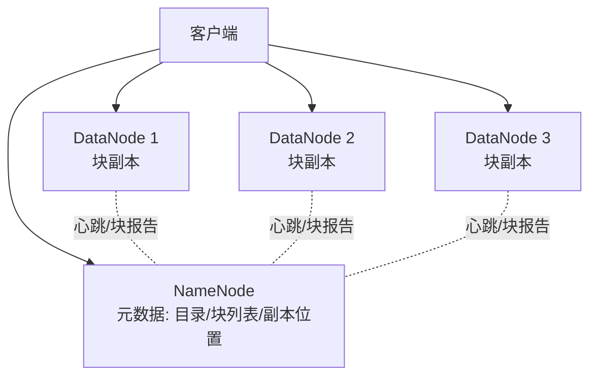
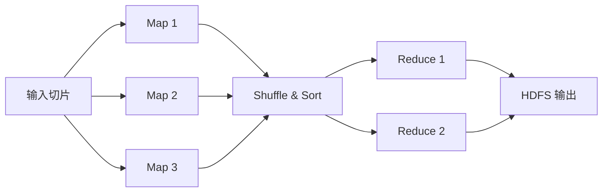

import WordCount from '../../../../src/components/WordCount/WordCount';
import Mermaid from '@theme/Mermaid';

<WordCount>

## 10.1 动机

### 10.1.1 大数据的来源和使用

自 21 世纪初以来，人类产生的数据量呈指数级增长。数据来源不再局限于事务处理系统（OLTP），还包括：

- **Web 与移动**：点击流、页面访问、搜索日志、社交动态。
- **物联网**：传感器读数、GPS 轨迹、监控视频、可穿戴设备。
- **企业内部**：应用日志、审计流水、协作平台、邮件。
- **第三方**：地图、气象、征信、开放数据。

「大数据（Big Data）」通常用 4V 概括其挑战：

| 维度 | 含义 |
| --- | --- |
| Volume | 体量巨大，PB～EB 级 |
| Velocity | 流入速度快，毫秒~秒级新鲜度 |
| Variety | 类型多样，结构化、半结构化、非结构化并存 |
| Veracity | 质量不一，需要清洗与治理 |

大数据的用途覆盖商业智能、个性化推荐、欺诈检测、精准营销、智能制造、疾病预测等，几乎所有行业都在被数据重塑。

### 10.1.2 大数据查询

传统集中式关系数据库在 TB 级尚可胜任，但到 PB 级时就受制于单机的存储与计算能力。面对大数据，查询需求也发生了变化：

- **批处理**：对全量历史数据做扫描与聚合，一次几分钟到几小时。
- **交互式分析**：在数亿到千亿行数据上执行 ad-hoc SQL，秒到十几秒。
- **流处理**：对不断流入的事件做实时聚合与告警。
- **机器学习**：数据规模驱动模型训练。

这些需求推动了分布式文件系统、并行数据库、MapReduce、Spark、流计算引擎、图计算等一系列系统的出现。

---

## 10.2 大数据存储系统

### 10.2.1 分布式文件系统

**GFS（Google File System）** 与其开源实现 **HDFS（Hadoop Distributed File System）** 奠定了大数据存储的基石。核心思路：把一个大文件按块（64/128/256 MB）切分，分布存储到多台廉价机器上，并保存多副本以容错。



关键特性：

- **一次写入、多次读取**：追加友好，随机改写弱化。
- **数据本地性**：计算尽量调度到数据所在节点，减少网络。
- **容错**：默认三副本；副本丢失时 NameNode 自动补齐。

### 10.2.2 分片

**分片（sharding / partitioning）** 把数据横向拆到多个节点上，是分布式数据库扩展的核心手段。常见策略：

- **范围分片**：按主键值区间分片，便于范围查询，但可能热点。
- **哈希分片**：主键哈希后取模，负载均匀，但范围扫描要广播。
- **一致性哈希**：节点扩容时只影响少量键，Cassandra/Riak 使用。
- **列表分片**：按枚举值分（例如按地区）。

选择时要综合考虑访问模式、扩缩容频率、热点数据分布。

### 10.2.3 键值存储系统

**键值存储（Key-Value store）** 是 NoSQL 家族最简单的一类，接口只有 `put(k,v)`、`get(k)`、`delete(k)`。为满足不同场景又分化出：

- **纯 K-V**：Redis、Memcached、Amazon DynamoDB。
- **文档型**：MongoDB、Couchbase，值是 JSON 文档。
- **列族型**：HBase、Cassandra，值是「列族+版本」的稀疏矩阵。
- **搜索型**：Elasticsearch，把文档索引到倒排结构上。

对比 SQL：牺牲了完整的关系代数与事务一致性，换取极端的可扩展性与写入吞吐。

### 10.2.4 并行和分布式数据库

**并行数据库（parallel database）** 在多节点上运行一份数据库软件，把 SQL 查询编译成分布式执行计划：

- **Shared-nothing 架构**：每个节点私有 CPU/内存/磁盘，通过网络协调。可无限扩展，是主流选择（Teradata、Greenplum、Vertica、Redshift、TiDB、ClickHouse）。
- **Shared-disk 架构**：所有节点共享存储，节点间靠锁协调（Oracle RAC）。

分布式数据库通常将表按分片键切分（partitioning），并支持并行扫描、分区裁剪、并行聚合、Bloom Join 等优化。

### 10.2.5 复制和一致性

数据在多副本间保持一致是分布式系统的核心难题。根据 **CAP 定理**，在网络分区发生时只能在一致性（C）与可用性（A）中二选一。工程实践中常见策略：

- **主从复制**：写主，读可从从库；从库最终一致。
- **多主复制**：多点写入，需解决冲突。
- **Quorum 读写**：设 $N$ 副本，写 $W$ 个成功、读 $R$ 个成功，$W+R>N$ 可保证强一致。
- **共识协议**：Paxos、Raft、ZAB，用于选主与日志复制。

一致性模型也从强到弱形成谱系：线性化 → 顺序一致 → 因果一致 → 最终一致。选择哪种取决于业务对新鲜度与可用性的要求。

---

## 10.3 MapReduce范式

### 10.3.1 为什么要使用MapReduce

MapReduce 由 Google 在 2004 年提出，目的是让程序员不写分布式框架代码就能并行处理海量数据。它抽象出两个函数：

- `map(k1, v1) → list((k2, v2))`：对每条输入做变换，产出中间键值对。
- `reduce(k2, list(v2)) → list((k3, v3))`：对同一个中间键的所有值做聚合。

框架自动完成：切分输入、启动任务、按键洗牌（shuffle）、失败重试、结果汇总。

### 10.3.2 MapReduce示例1：词汇统计

经典的「词频统计」（word count）伪码：

```text
map(String docId, String line):
    for each word w in split(line):
        emit(w, 1)

reduce(String w, Iterator<Integer> counts):
    int sum = 0
    for each c in counts:
        sum += c
    emit(w, sum)
```

Hadoop Streaming 下用 Python 实现同样的逻辑：

```python
# mapper.py
import sys
for line in sys.stdin:
    for w in line.strip().split():
        print(f"{w}\t1")

# reducer.py
import sys
cur, cnt = None, 0
for line in sys.stdin:
    w, c = line.rstrip().split('\t')
    if w == cur:
        cnt += int(c)
    else:
        if cur is not None:
            print(f"{cur}\t{cnt}")
        cur, cnt = w, int(c)
if cur is not None:
    print(f"{cur}\t{cnt}")
```

### 10.3.3 MapReduce示例2：日志处理

典型的 Web 服务器访问日志分析——统计每个 URL 每天的访问次数并按大小排序：

```text
map(String logId, String line):
    parse line: (ip, ts, url, status, bytes)
    day = date(ts)
    emit((url, day), 1)

reduce((String url, String day), Iterator<Integer> ones):
    emit((url, day), sum(ones))
```

之后再挂一个 MapReduce 作业按访问次数排序：

```text
map((url, day), count):
    emit(count, (url, day))       // 按次数分桶

reduce(count, Iterator<Pair> items):
    for each (url, day) in items:
        emit((count, url, day), null)
```

这种「多阶段流水线」模式在 Hive、Pig 中被大量使用。

### 10.3.4 MapReduce任务的并行处理

MapReduce 的并行来自两级切分：

1. **输入切片**：默认每个 HDFS 块作为一个 map 任务的输入。
2. **中间键分桶**：`hash(key) mod R`，把中间结果分到 R 个 reduce 任务。

框架执行的关键阶段：



任务失败时框架会自动在别的节点重新调度；节点数量决定并行度，理论上线性可扩展。

### 10.3.5 Hadoop中的MapReduce

Hadoop 项目提供了 MapReduce 的开源实现，配合 HDFS 与 YARN 构成完整的批处理平台：

- **HDFS**：分布式文件系统。
- **YARN**：资源调度与容器管理。
- **MapReduce**：批处理编程模型。
- **生态**：Hive（SQL 编译到 MR/Tez/Spark）、Pig（数据流脚本）、HBase（在 HDFS 上的列族存储）、Sqoop（RDBMS 导入导出）、Oozie（工作流）。

### 10.3.6 MapReduce上的SQL

原生 MapReduce 编程门槛高，Hive 与之后的 SparkSQL、Presto、Trino 把 SQL 编译成分布式作业：

```sql
SELECT url, day, COUNT(*) AS n
FROM   access_log
WHERE  status = 200
GROUP  BY url, day
ORDER  BY n DESC
LIMIT  100;
```

背后的物理算子（TableScan、Filter、HashAggregate、Shuffle、Sort）与 MapReduce 的 Map/Reduce 一一对应。今天绝大多数「大数据 SQL」都走这条路线，MapReduce 本身逐渐退居底层执行引擎的角色。

---

## 10.4 超越MapReduce：代数运算

### 10.4.1 代数运算的动机

MapReduce 有两个突出问题：

1. **过于底层**：所有逻辑都要塞进两个函数，多阶段任务需要人工串联。
2. **磁盘依赖**：每个阶段的中间结果都要写回 HDFS，迭代类算法（PageRank、K-Means）代价高昂。

社区提出更高层的 **代数（algebraic）运算**：Map、Filter、FlatMap、Reduce、Join、GroupBy、Aggregate 等有明确语义的算子可以自由组合，执行引擎负责合并 pipeline、内存化中间结果。

### 10.4.2 Spark中的代数运算

**Apache Spark** 用弹性分布式数据集 **RDD（Resilient Distributed Dataset）** 承载数据，用一系列变换（transformation）与动作（action）构建 DAG，惰性执行；只有遇到 action 才真正触发计算。

```python
# 词频统计
from pyspark import SparkContext
sc = SparkContext("local[*]", "wordcount")

counts = (sc.textFile("hdfs:///logs/*.txt")
            .flatMap(lambda line: line.split())
            .map(lambda w: (w, 1))
            .reduceByKey(lambda a, b: a + b))
counts.saveAsTextFile("hdfs:///out/wc")
```

```python
# 日志分析：Top 100 URL
sc.textFile("hdfs:///access/*.log") \
  .map(parse) \
  .filter(lambda r: r.status == 200) \
  .map(lambda r: ((r.url, r.day), 1)) \
  .reduceByKey(lambda a, b: a + b) \
  .map(lambda kv: (kv[1], kv[0])) \
  .sortByKey(ascending=False) \
  .take(100)
```

Spark 的优势：

- **DAG 引擎**：合并多阶段，避免每步落盘。
- **内存缓存**：`rdd.cache()` 让迭代算法在数量级上加速。
- **统一栈**：SparkSQL（DataFrame）、MLlib、GraphX、Structured Streaming 共享底层。

DataFrame API 让 SQL 与代数运算无缝混合：

```python
from pyspark.sql import SparkSession, functions as F
spark = SparkSession.builder.appName("dsc").getOrCreate()
df = spark.read.parquet("hdfs:///access.parquet")
(df.filter("status = 200")
   .groupBy("url", "day").agg(F.count("*").alias("n"))
   .orderBy(F.desc("n")).show(100))
```

---

## 10.5 流数据

### 10.5.1 流数据的应用

**流数据（stream data）** 是持续产生、时序性强、往往一次性只能扫过一次的数据：股票行情、点击流、GPS 位置、监控视频、IoT 传感器读数。典型应用：

- 实时监控与告警（异常检测）。
- 实时推荐与个性化定价。
- 反欺诈与风控。
- 车联网、智慧城市。

### 10.5.2 流数据查询

流查询与批处理有几个显著不同：

- **窗口（window）**：查询不能在无界流上运行，需要划分有限区间——滚动窗口、滑动窗口、会话窗口。
- **时间语义**：事件时间（event time）与处理时间（processing time）；乱序到达时靠**水位线（watermark）** 判断窗口何时结束。
- **状态管理**：聚合、连接需要维护状态，必须提供故障恢复。
- **精确一次（exactly-once）**：借助 checkpoint 与幂等 sink 实现端到端一次语义。

一个 Flink SQL 示例——每分钟统计每种商品的销量：

```sql
SELECT product_id,
       TUMBLE_START(event_time, INTERVAL '1' MINUTE) AS win,
       SUM(qty) AS total
FROM   orders
GROUP  BY product_id,
          TUMBLE(event_time, INTERVAL '1' MINUTE);
```

### 10.5.3 流上的代数运算

流处理引擎（Apache Flink、Kafka Streams、Spark Structured Streaming）把 Map、Filter、KeyBy、Window、Aggregate、Join 等算子组合成 **有向无环图**，与批处理共享算子语义。批与流的差别更多体现在触发条件与状态语义上：批是「有限流」，流是「无限批」——Flink 提出的「流批一体」正是这一理念的产物。

---

## 10.6 图数据库

**图数据库（graph database）** 直接以「顶点+边」建模关系数据：社交好友、推荐、知识图谱、金融反洗钱、供应链、生物网络。相比关系表反复自连接，图查询语言（Cypher、Gremlin、GQL）让路径查询变得自然：

```cypher
// Neo4j Cypher：查找 Alice 的朋友的朋友，排除她自己
MATCH (a:Person {name:'Alice'})-[:FRIEND]->()-[:FRIEND]->(b:Person)
WHERE a <> b
RETURN DISTINCT b.name;
```

图计算引擎（Pregel、GraphX、Giraph、Gemini）为 PageRank、连通分量、最短路径等经典算法提供 **BSP（Bulk Synchronous Parallel）** 模型：顶点在超步（superstep）中接收消息、更新状态、发送消息，直到收敛。

一个 PageRank 的伪码：

```text
init: rank[v] = 1/N
for iter in 1..K:
    for each v: send rank[v]/deg(v) to each neighbor
    for each v: rank[v] = 0.15/N + 0.85 * sum(msgs)
```

对比 SQL 的多次自连接，BSP 的表达力和执行效率都显著更好。

---

## 10.7 总结

- 大数据的 4V 特征（Volume、Velocity、Variety、Veracity）推动了新一代存储与计算系统的诞生。
- HDFS 提供分布式文件存储，分片与复制解决扩展和容错；键值/文档/列族/搜索型 NoSQL 各自服务不同访问模式；并行数据库继续把 SQL 推向 PB 级。
- CAP 与一致性模型指导副本设计；Paxos/Raft 是共识的工程实现。
- MapReduce 抽象出 Map+Reduce 两段式并行范式，代表性实现是 Hadoop；SQL-on-Hadoop（Hive、SparkSQL、Presto）让分析师无须写代码。
- Spark 的 RDD/DataFrame 用 DAG 与内存缓存超越 MapReduce，支撑批处理、SQL、机器学习、图计算的统一栈。
- 流处理以窗口、水位线、状态与 Exactly-Once 语义支撑实时业务，Flink/Kafka Streams 是主流引擎。
- 图数据库与图计算引擎针对连接密集型场景提供更自然的表达与更高效的执行。
- 大数据不是替换 SQL，而是把 SQL、代数运算与新型系统结合，服务更宽广的数据形态与业务需求。

</WordCount>
