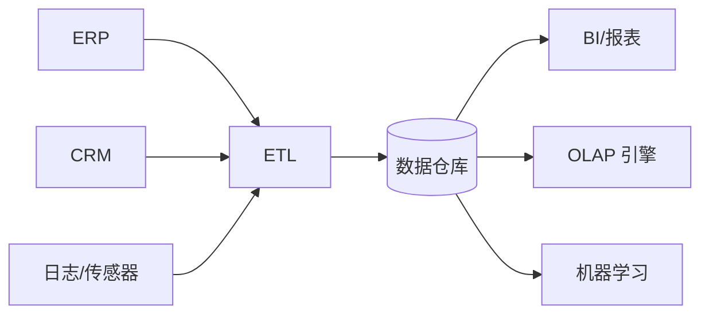
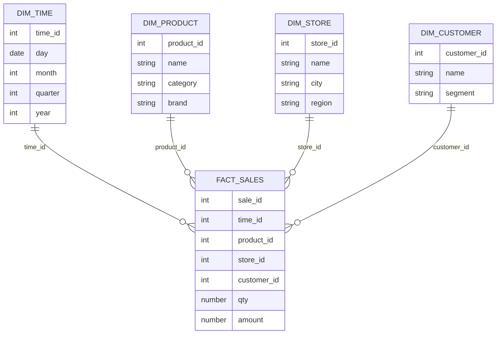
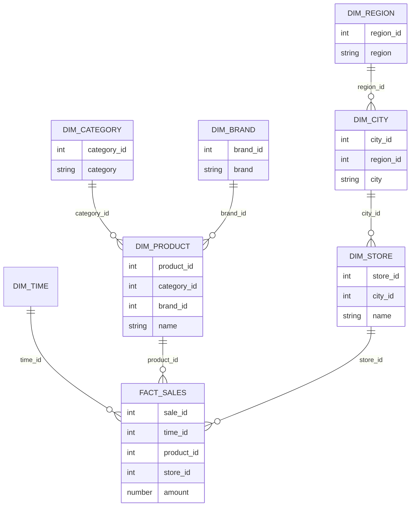

import WordCount from '../../../../src/components/WordCount/WordCount';
import Mermaid from '@theme/Mermaid';

<WordCount>

## 11.1 分析概述

**分析（analytics）** 是指从大量历史数据中提取洞察、支持决策的一系列技术与流程。与在线事务处理（OLTP）关注「记录发生了什么」不同，分析强调「理解已经发生的、预测将要发生的、指导应当采取的行动」。学术界与工业界把分析大致分为四类：

| 类型 | 问题 | 典型方法 |
| --- | --- | --- |
| 描述性（Descriptive） | 发生了什么？ | 报表、Dashboard、聚合统计 |
| 诊断性（Diagnostic） | 为什么发生？ | 下钻、维度分析、A/B 检验 |
| 预测性（Predictive） | 将来会发生什么？ | 回归、分类、时间序列 |
| 规约性（Prescriptive） | 该做什么？ | 优化、模拟、强化学习 |

对应的技术栈由三大组件构成：**数据仓库/数据湖**（存储与组织）、**OLAP**（交互式多维分析）、**数据挖掘/机器学习**（自动发现模式）。

---

## 11.2 数据仓库

### 11.2.1 数据仓库成分

**数据仓库（Data Warehouse, DW）** 是面向主题、集成、非易失、随时间变化的数据集合，为决策支持而生。其组成通常包括：

1. **数据源**：业务系统（ERP、CRM）、日志、外部数据。
2. **ETL/ELT 层**：抽取（Extract）、清洗与转换（Transform）、加载（Load）。
3. **仓库存储**：分区、物化视图、列存、索引。
4. **元数据管理**：血缘、字段字典、数据质量指标。
5. **访问层**：BI 工具、报表、Ad-hoc SQL、OLAP。



### 11.2.2 多维数据与数据仓库模式

数据仓库的核心建模思路是把业务事件抽象为**事实（fact）**，把描述性属性抽象为**维度（dimension）**。

- **事实表**：粒度小、行数大、字段以度量（销售额、销量、金额）为主。
- **维度表**：粒度大、行数小、字段以描述性属性（名称、层级）为主。

最常用的两种物理模式：

**星型模式（Star Schema）** — 一张事实表居中，若干维度表以外键指向它，结构最简单，查询最快：



**雪花模式（Snowflake Schema）** — 对维度进一步规范化，把层级拆成多张表，节省空间但需要更多连接：



对于极复杂的层级还有 **星座模式（Fact Constellation / Galaxy Schema）**：多个事实表共享维度表。选择哪种模式取决于加载效率、存储成本与查询模式之间的权衡。

### 11.2.3 数据仓库的数据库支持

现代分析型数据库（也称 MPP 数据库）为数据仓库量身设计，特点包括：

- **列式存储**：只读需要的列，压缩率高（Parquet/ORC 亦然）。
- **向量化执行**：批量处理数据，充分利用 CPU SIMD 与缓存。
- **压缩与编码**：字典编码、RLE、Bit-packing。
- **物化视图与自动汇总**：把常用聚合预先算好。
- **分区裁剪与统计信息**：只扫描相关分区。
- **MPP 并行**：Shared-nothing 集群横向扩展。

代表产品：Snowflake、Amazon Redshift、Google BigQuery、Azure Synapse、Vertica、Greenplum、ClickHouse、Doris、StarRocks。

### 11.2.4 数据湖

**数据湖（Data Lake）** 与数据仓库相辅相成：直接存储原始文件（结构化 + 半结构化 + 非结构化），采用便宜的对象存储（S3、OSS、HDFS），保留任意粒度的历史数据。分析引擎（Spark、Presto、Trino、Flink）以 schema-on-read 的方式按需解析。

新一代**湖仓一体（Lakehouse）** 架构（Delta Lake、Apache Iceberg、Apache Hudi）在数据湖之上加入 ACID 事务、Schema 演化、Time Travel、增量更新，兼具湖的开放性与仓的可靠性。

---

## 11.3 联机分析处理

### 11.3.1 多维数据上的聚集

**OLAP（OnLine Analytical Processing）** 以「立方体（cube）」的心智模型看数据：每个维度是一根坐标轴，度量是格子里的值。常见的操作：

- **切片（slice）**：固定一维取值，得到子立方。例如「只看 2024 年」。
- **切块（dice）**：多个维度都取子集。「2024 年 + 华东 + 手机品类」。
- **上卷（roll-up）**：沿层级向上聚合。「日 → 月 → 年」。
- **下钻（drill-down）**：沿层级向下细化。「年 → 月 → 日」。
- **旋转（pivot）**：交换横纵维度，得到不同的透视视图。

### 11.3.2 交叉表的关系表示

BI 工具展现结果时常用**交叉表（cross-tab / pivot table）**：行是一个维度、列是另一个维度、格子是聚合值。例如：

| 品类 \ 年份 | 2022 | 2023 | 2024 | 合计 |
| --- | --- | --- | --- | --- |
| 手机 | 100 | 120 | 150 | 370 |
| 电脑 | 60 | 90 | 110 | 260 |
| 家电 | 40 | 55 | 70 | 165 |
| 合计 | 200 | 265 | 330 | 795 |

在关系模型中，把交叉表映射为「维度列 + 度量列」的普通表——多出的「合计」行/列即为聚合小计与总计，可以用 `GROUP BY ... WITH ROLLUP`/`CUBE` 生成。

### 11.3.3 SQL中的OLAP

SQL:1999 及以后扩展了三种超级聚合语法：

**ROLLUP**：按维度层级递推小计与总计。

```sql
SELECT category, year, SUM(amount) AS total
FROM   sales
GROUP  BY ROLLUP(category, year);
-- 等价于对以下分组集合求并：
-- (category, year), (category), ()
```

**CUBE**：所有维度子集的组合，共 $2^n$ 种。

```sql
SELECT category, region, year, SUM(amount)
FROM   sales
GROUP  BY CUBE(category, region, year);
```

**GROUPING SETS**：显式列出感兴趣的分组集合，比 CUBE 更精细。

```sql
SELECT category, region, year, SUM(amount)
FROM   sales
GROUP  BY GROUPING SETS (
   (category, region, year),
   (category, year),
   (region, year),
   ()
);
```

配合 `GROUPING(col)` 或 `GROUPING_ID(...)` 可以判断当前行是哪一级别的小计。

**窗口函数（Window Function）** 是另一类分析利器：

```sql
SELECT product_id,
       month,
       amount,
       SUM(amount) OVER (PARTITION BY product_id ORDER BY month
                         ROWS BETWEEN 2 PRECEDING AND CURRENT ROW) AS ma3,
       RANK() OVER (PARTITION BY month ORDER BY amount DESC)       AS rk
FROM sales_monthly;
```

它无须 GROUP BY 就能在保留明细行的同时计算聚合、移动平均、同比、排名。

### 11.3.4 报表和可视化工具

BI 工具（Tableau、Power BI、FineBI、Superset、Metabase、Looker）在数据仓库之上提供拖拽式的报表与可视化，允许业务人员自助分析。它们背后都靠向数据源发送 SQL（或 MDX），拿到聚合结果后渲染成柱图、折线、饼图、地图、热力图、桑基图等。

---

## 11.4 数据挖掘

### 11.4.1 数据挖掘任务的类型

**数据挖掘（Data Mining）** 是从大规模数据中自动发现规律和模式的过程，常分为几大任务：

- **分类（Classification）**：把样本分到已知类别中，属于有监督学习。
- **回归（Regression）**：预测数值型目标。
- **关联规则（Association Rule Mining）**：发现「购买 A 的顾客也常买 B」型规律。
- **聚类（Clustering）**：把样本自然分组，属于无监督学习。
- **异常检测（Anomaly Detection）**：找出偏离常态的点。
- **序列/时间模式**：日志、行为链、时间序列。

### 11.4.2 分类

**决策树（Decision Tree）** 是最易理解的分类模型：每个内部节点是一个属性测试、每条边是一个测试结果、每个叶子是一个类别标签。构建时采用贪心策略，用**信息增益**、**信息增益率** 或 **基尼指数** 选择最能「拉开」两类的属性：

$$
\mathrm{Entropy}(S) = - \sum_i p_i \log_2 p_i
$$
$$
\mathrm{Gain}(S, A) = \mathrm{Entropy}(S) - \sum_{v \in V(A)} \frac{|S_v|}{|S|} \mathrm{Entropy}(S_v)
$$

经典算法：ID3、C4.5、CART。集成方法（Random Forest、Gradient Boosting Decision Tree、XGBoost、LightGBM）把多棵树组合起来，是工业界胜任大多数结构化数据分类任务的首选。

**朴素贝叶斯（Naive Bayes）** 基于贝叶斯定理并假设各特征条件独立：

$$
P(c \mid x_1,\dots,x_n) \propto P(c) \prod_{i=1}^n P(x_i \mid c)
$$

要点：

- 在垃圾邮件、文本分类等高维稀疏场景下极为有效。
- 需要对连续变量做离散化或假设正态分布。
- 训练开销极低，可增量更新。
- 「独立性假设」通常并不成立，但许多时候仍能给出令人满意的结果。

其他重要分类模型还有：逻辑回归、支持向量机（SVM）、k 近邻（k-NN）、神经网络与深度学习。

### 11.4.3 回归

回归预测数值型目标。最基础的是 **线性回归**：

$$
y = \beta_0 + \beta_1 x_1 + \cdots + \beta_p x_p + \epsilon
$$

参数由最小二乘估计：$\hat{\beta} = (X^T X)^{-1} X^T y$。评估指标包括 MSE、RMSE、MAE、R²。变体有岭回归（L2 正则）、Lasso（L1 正则）、弹性网。非线性场景可用决策树回归、GBDT、神经网络。

### 11.4.4 关联规则

**关联规则挖掘** 的经典场景是购物篮分析。关联规则形如 $X \Rightarrow Y$，其中 $X, Y$ 是不相交的项集。三个关键度量：

$$
\text{支持度 support}(X \Rightarrow Y) = P(X \cup Y) = \frac{\#(X \cup Y)}{|D|}
$$

$$
\text{置信度 confidence}(X \Rightarrow Y) = P(Y \mid X) = \frac{\text{support}(X \cup Y)}{\text{support}(X)}
$$

$$
\text{提升度 lift}(X \Rightarrow Y) = \frac{\text{confidence}(X \Rightarrow Y)}{\text{support}(Y)}
$$

**Apriori 算法** 利用「频繁项集的所有子集也必频繁」这一反单调性剪枝，从 1-项集逐层生成候选 k-项集：

```text
L1 = {频繁 1-项集}
for k = 2; Lk-1 非空; k++:
    Ck = apriori_gen(Lk-1)              # 由 Lk-1 生成 k-项集候选
    for each 事务 t in D:
        Ct = subset(Ck, t)              # t 中出现的候选
        for each c in Ct: c.count += 1
    Lk = { c ∈ Ck | c.count/|D| ≥ minsup }
return ⋃_k Lk
```

之后再从频繁项集中枚举满足置信度阈值的规则。改进算法 FP-Growth 用「频繁模式树」避免候选集爆炸。

### 11.4.5 聚类

聚类把相似样本聚在同一组、不同组之间差异最大。常见方法：

- **k-means**：预定 k 个中心，迭代「分配 → 更新中心」直到收敛；简单快速，但要指定 k、对形状与噪声敏感。
- **层次聚类**：自底向上合并（Agglomerative）或自顶向下分裂（Divisive），输出树状图（dendrogram）。
- **DBSCAN**：基于密度，自动发现簇数，能识别噪声，适合非球形簇。
- **谱聚类**：借助图拉普拉斯矩阵的特征向量嵌入。
- **高斯混合模型（GMM）**：软聚类，用 EM 估计。

评估指标：轮廓系数（Silhouette）、Davies-Bouldin 指数、外部有标签时用 ARI/NMI。

### 11.4.6 文本挖掘

**文本挖掘** 是把非结构化文本转化为可分析结构的过程，典型任务包括：

- 文本分类：新闻主题、情感分析、垃圾邮件。
- 命名实体识别：人名、地名、机构、金额、时间。
- 主题模型：LDA 从文档集抽取隐含主题。
- 摘要与问答：抽取式与生成式。
- 词向量与语言模型：Word2Vec、GloVe、BERT、GPT。

数据准备通常包括分词、去停用词、词干还原、TF-IDF/BM25 向量化，或用预训练的深度模型直接得到句/段嵌入。文本挖掘与信息检索、NLP、机器学习深度交叉，也是当代大模型技术的直接基础。

---

## 11.5 总结

- 数据分析回答「发生了什么、为什么、将来如何、该做什么」四类问题，覆盖描述、诊断、预测、规约。
- 数据仓库为分析而生，以事实-维度建模；星型模式简单高效，雪花模式规范化更彻底，星座模式适合复杂业务。
- 现代仓库依托列存、向量化、MPP、物化视图；数据湖与湖仓一体扩大了数据的开放性与规模。
- OLAP 用切片/切块/上卷/下钻/旋转操作立方体；SQL 通过 ROLLUP、CUBE、GROUPING SETS 与窗口函数把这些能力标准化。
- 数据挖掘从海量数据中自动发现分类、回归、关联、聚类、异常等模式；决策树与朴素贝叶斯是最经典的分类模型；Apriori 用支持度与置信度挖掘关联规则。
- 文本挖掘把非结构化数据引入分析栈，为搜索、推荐、问答与大模型奠基。
- 分析系统是数据库、并行计算、统计学习共同演化的产物，也是数据驱动决策文化的技术支撑。

</WordCount>
