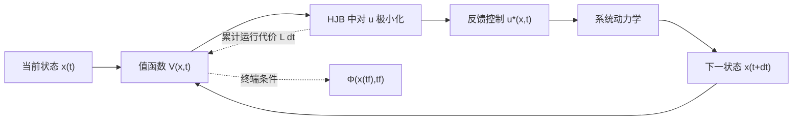

import WordCount from '../../../src/components/WordCount/WordCount';

<WordCount>

# 最优控制

最优控制研究的是：在系统动力学、初末状态和输入约束给定时，如何选择控制函数，使某个性能指标最小。它把“系统能否被控制”推进到“应当怎样控制才最好”，也是 LQR、MPC、LQG 和部分强化学习方法的共同理论基础。

本章不嵌入 `VideoPlayer`：当前没有可靠的视频元数据，尤其不应猜测或伪造原视频 `p=61+` 的地址，因此以下内容以可独立复习的文字推导和例题为主。

## 7.1 最优控制问题的标准形式

### 7.1.1 状态方程

考虑连续时间系统

$$
\dot{x}(t)=f\bigl(x(t),u(t),t\bigr),\qquad x(t_0)=x_0,
$$

其中 $x(t)\in\mathbb{R}^n$ 是状态，$u(t)\in\mathbb{R}^m$ 是控制。要寻找的是一条容许控制 $u(\cdot)$，以及由它产生的状态轨迹 $x(\cdot)$。

### 7.1.2 Bolza 型性能指标

最常用的一般形式是 Bolza 型指标：

$$
J[u(\cdot)]
=
\Phi\bigl(x(t_f),t_f\bigr)
+
\int_{t_0}^{t_f}L\bigl(x(t),u(t),t\bigr)\,\mathrm{d}t.
$$

- $\Phi$ 是终端代价，例如终点偏差；
- $L$ 是运行代价，例如状态误差、能耗和时间；
- 若只有积分项，称为 Lagrange 型；若只有终端项，称为 Mayer 型；
- 通过增加一个满足 $\dot{x}_{n+1}=L$ 的状态，可在这些形式之间转换。

### 7.1.3 边界条件与约束

边界条件可能包括

$$
x(t_0)=x_0,\qquad
\psi\bigl(x(t_f),t_f\bigr)=0,
$$

其中终端时刻 $t_f$、终端状态的全部分量或部分分量可以固定，也可以自由。常见约束还有

$$
u(t)\in\mathcal{U},\qquad
x(t)\in\mathcal{X},\qquad
g\bigl(x(t),u(t),t\bigr)\leq 0.
$$

输入饱和、速度上限和避障都属于约束。无约束 LQR 给出的控制量若超过执行器能力，就不再是原物理问题的可行解；这也是实际系统转向约束优化或 MPC 的重要原因。

<svg
  role="img"
  aria-label="状态平面中的代价等高线、起点、目标点与最优轨迹"
  viewBox="0 0 720 410"
  style={{ width: '100%', maxWidth: '760px', color: 'var(--ifm-color-content)', background: 'var(--ifm-background-color)', border: '1px solid var(--ifm-color-emphasis-300)', borderRadius: '8px' }}
>
  <defs>
    <marker id="oc-axis-arrow" markerWidth="8" markerHeight="8" refX="7" refY="4" orient="auto">
      <path d="M0,0 L8,4 L0,8 Z" fill="currentColor" />
    </marker>
    <marker id="oc-path-arrow" markerWidth="8" markerHeight="8" refX="7" refY="4" orient="auto">
      <path d="M0,0 L8,4 L0,8 Z" fill="var(--ifm-color-primary)" />
    </marker>
  </defs>
  <line x1="70" y1="350" x2="675" y2="350" stroke="currentColor" strokeWidth="2" markerEnd="url(#oc-axis-arrow)" />
  <line x1="70" y1="350" x2="70" y2="38" stroke="currentColor" strokeWidth="2" markerEnd="url(#oc-axis-arrow)" />
  <text x="680" y="375" fill="currentColor" fontSize="18">x₁</text>
  <text x="42" y="34" fill="currentColor" fontSize="18">x₂</text>
  <ellipse cx="525" cy="125" rx="145" ry="92" fill="none" stroke="currentColor" strokeOpacity="0.35" strokeWidth="2" />
  <ellipse cx="525" cy="125" rx="102" ry="64" fill="none" stroke="currentColor" strokeOpacity="0.5" strokeWidth="2" />
  <ellipse cx="525" cy="125" rx="58" ry="36" fill="none" stroke="currentColor" strokeOpacity="0.7" strokeWidth="2" />
  <text x="586" y="225" fill="currentColor" fontSize="16">代价等高线</text>
  <circle cx="150" cy="295" r="7" fill="var(--ifm-color-danger)" />
  <text x="102" y="325" fill="currentColor" fontSize="16">起点 x(t₀)</text>
  <circle cx="525" cy="125" r="8" fill="var(--ifm-color-success)" />
  <text x="540" y="115" fill="currentColor" fontSize="16">目标 x_f</text>
  <path
    d="M150,295 C245,312 278,238 348,238 C423,238 427,158 518,129"
    fill="none"
    stroke="var(--ifm-color-primary)"
    strokeWidth="4"
    markerEnd="url(#oc-path-arrow)"
  />
  <path d="M150,295 C255,180 370,100 525,125" fill="none" stroke="currentColor" strokeOpacity="0.3" strokeWidth="2" strokeDasharray="7 7" />
  <text x="283" y="272" fill="var(--ifm-color-primary)" fontSize="17">最优轨迹 x*(t)</text>
  <text x="240" y="125" fill="currentColor" fontSize="15">另一条可行轨迹</text>
</svg>

图中的等高线只是“代价随状态变化”的几何示意。真正的最优轨迹必须同时满足动力学和全部约束，并非状态平面上任意最短曲线。

## 7.2 变分法与 Euler–Lagrange 方程

先考虑不显含控制和状态方程约束的泛函

$$
J[x]=\int_{t_0}^{t_f}F\bigl(x(t),\dot{x}(t),t\bigr)\,\mathrm{d}t,
$$

且两端固定。对候选轨迹作微小扰动

$$
x_\varepsilon(t)=x^*(t)+\varepsilon\eta(t),\qquad
\eta(t_0)=\eta(t_f)=0.
$$

最优轨迹的一阶变分必须为零：

$$
\left.\frac{\mathrm{d}}{\mathrm{d}\varepsilon}
J[x_\varepsilon]\right|_{\varepsilon=0}
=
\int_{t_0}^{t_f}
\left(
\frac{\partial F}{\partial x}^{\mathsf T}\eta
+
\frac{\partial F}{\partial\dot{x}}^{\mathsf T}\dot{\eta}
\right)\mathrm{d}t=0.
$$

对含 $\dot{\eta}$ 的项分部积分，并利用端点扰动为零，得到 Euler–Lagrange 方程

$$
\boxed{
\frac{\mathrm{d}}{\mathrm{d}t}
\left(\frac{\partial F}{\partial\dot{x}}\right)
-
\frac{\partial F}{\partial x}=0
}.
$$

若终点自由，分部积分留下的边界项不会自动消失，从而产生自然边界条件（横截条件）。变分法展示了“最优解的一阶扰动不能继续降低代价”的核心思想，但直接处理状态方程和控制约束并不方便。Pontryagin 极小值原理可看作把这一思想系统地用于受控动力系统。

## 7.3 Pontryagin 极小值原理

以下采用“最小化 Hamiltonian”的符号约定。定义 Hamiltonian

$$
H(x,u,\lambda,t)
=
L(x,u,t)+\lambda^{\mathsf T}f(x,u,t),
$$

其中 $\lambda(t)\in\mathbb{R}^n$ 是协态变量，也可理解为状态变化对最优代价的边际影响。

对正常情形，若 $(x^*,u^*)$ 是局部最优解，则存在非零的协态，使下列条件成立。

### 7.3.1 状态方程

$$
\dot{x}^*
=
\frac{\partial H}{\partial\lambda}
=
f(x^*,u^*,t).
$$

### 7.3.2 协态方程

$$
\dot{\lambda}
=
-\frac{\partial H}{\partial x}
=
-\frac{\partial L}{\partial x}
-
\left(\frac{\partial f}{\partial x}\right)^{\mathsf T}\lambda.
$$

状态通常从 $t_0$ 向前积分，协态由终端条件从 $t_f$ 向后积分，因此最优控制常形成一个两点边值问题。

### 7.3.3 极小值（或驻值）条件

有控制约束时，

$$
u^*(t)\in
\arg\min_{u\in\mathcal{U}}
H\bigl(x^*(t),u,\lambda(t),t\bigr).
$$

若 $u^*$ 位于 $\mathcal U$ 内部且 $H$ 对 $u$ 可微，则必要条件退化为

$$
\frac{\partial H}{\partial u}=0.
$$

“驻值”不等于“最小值”。还应检查 $\partial^2H/\partial u^2$、控制边界及整体问题结构。控制受限且 Hamiltonian 对控制呈线性时，最优输入常位于边界，形成 bang-bang 控制，此时不能只套用驻值方程。

### 7.3.4 横截条件

若 $t_f$ 固定而终端状态自由，

$$
\lambda(t_f)
=
\frac{\partial\Phi}{\partial x}\bigl(x(t_f),t_f\bigr).
$$

若终端满足约束 $\psi(x(t_f),t_f)=0$，则存在乘子 $\nu$，使

$$
\lambda(t_f)
=
\Phi_x+\psi_x^{\mathsf T}\nu.
$$

若终端时刻也自由，还需满足

$$
H(t_f)+\Phi_t+\nu^{\mathsf T}\psi_t=0.
$$

若终端状态完全固定，则其端点变分为零，不会由变分推出上述自由终点条件。应根据“哪些终端分量自由”逐分量判断。

:::warning 必要条件不等于充分条件
PMP 通常只给出局部最优解必须满足的必要条件。满足状态方程、协态方程和驻值条件的轨迹，可能是极大值、鞍点或仅仅是驻轨迹。在线性动力学、凸控制集、凸代价等适当凸性条件下，才可能进一步得到充分性或唯一性。
:::

## 7.4 动态规划与 HJB 方程

### 7.4.1 值函数与最优性原理

定义从时刻 $t$、状态 $x$ 出发的最小剩余代价

$$
V(x,t)
=
\inf_{u(\cdot)}
\left[
\Phi(x(t_f),t_f)
+
\int_t^{t_f}L(x(\tau),u(\tau),\tau)\,\mathrm{d}\tau
\right].
$$

Bellman 最优性原理指出：最优策略的任意后半段，对它所到达的中间状态而言也必须是最优的。对短时间 $\Delta t$ 写出递推

$$
V(x,t)
=
\min_u
\left[
L(x,u,t)\Delta t
+
V\bigl(x+f(x,u,t)\Delta t,t+\Delta t\bigr)
\right].
$$

展开到一阶并令 $\Delta t\to0$，得到 Hamilton–Jacobi–Bellman 方程

$$
\boxed{
-V_t(x,t)
=
\min_{u\in\mathcal U}
\left[
L(x,u,t)+V_x(x,t)^{\mathsf T}f(x,u,t)
\right]
},
$$

终端条件为

$$
V(x,t_f)=\Phi(x,t_f).
$$

若 $V$ 足够光滑，则 $\lambda=V_x$，HJB 与 PMP 可以相互联系。两者侧重点不同：

- PMP 沿一条候选最优轨迹给出必要条件，维度较低，但常需解两点边值问题；
- HJB 在整个状态空间求值函数，直接产生状态反馈并具有全局含义，但受“维数灾难”限制；
- 值函数不光滑时需用黏性解等更一般概念，不能机械使用经典偏导数。



## 7.5 连续时间 LQR

线性二次型调节器（Linear Quadratic Regulator, LQR）是最重要的可解析最优控制问题之一。系统为

$$
\dot{x}=Ax+Bu.
$$

### 7.5.1 有限时域 LQR

取性能指标

$$
J
=
x(t_f)^{\mathsf T}F x(t_f)
+
\int_{t_0}^{t_f}
\left(
x^{\mathsf T}Qx+u^{\mathsf T}Ru
\right)\mathrm{d}t,
$$

其中通常 $F\succeq0$、$Q\succeq0$、$R\succ0$。设值函数为

$$
V(x,t)=x^{\mathsf T}P(t)x.
$$

代入 HJB 并对 $u$ 极小化，得到时变反馈律

$$
\boxed{
u^*(t)=-R^{-1}B^{\mathsf T}P(t)x(t)
}
$$

和微分 Riccati 方程

$$
\boxed{
-\dot{P}
=
A^{\mathsf T}P+PA
-
PBR^{-1}B^{\mathsf T}P+Q,
\qquad P(t_f)=F
}.
$$

注意 $P$ 从终端时刻向前积分。若性能指标在二次项前统一乘 $1/2$，只要 Hamiltonian 和终端条件也采用一致约定，最终反馈律不变。

### 7.5.2 无限时域 LQR

对时不变系统考虑

$$
J=\int_0^\infty
\left(x^{\mathsf T}Qx+u^{\mathsf T}Ru\right)\mathrm{d}t.
$$

稳态矩阵 $P$ 满足连续时间代数 Riccati 方程（CARE）

$$
\boxed{
A^{\mathsf T}P+PA
-
PBR^{-1}B^{\mathsf T}P+Q=0
}.
$$

稳定化解给出

$$
K=R^{-1}B^{\mathsf T}P,\qquad
u=-Kx,\qquad
A_{\mathrm{cl}}=A-BK.
$$

不要从 Riccati 方程的多个代数解中随意挑一个；需要选择使 $A-BK$ Hurwitz 的对称半正定稳定化解。在标准条件下，若 $(A,B)$ 可稳定、$(Q^{1/2},A)$ 可检测且 $R\succ0$，则存在唯一稳定化解。这里“可稳定”允许不可控模态存在，但所有不可控模态必须稳定；“可检测”允许不可观模态存在，但所有未被 $Q$ 感知的模态必须稳定。

### 7.5.3 如何选择 \(Q\) 与 \(R\)

- 增大某个 $Q_{ii}$：更强地抑制对应状态，通常响应更快，但控制更激烈；
- 增大 $R$：更珍惜控制能量，通常响应更慢、控制幅值更小；
- 状态和输入量纲不同，宜先归一化。Bryson 规则可取

$$
Q_{ii}\approx\frac{1}{x_{i,\max}^2},
\qquad
R_{jj}\approx\frac{1}{u_{j,\max}^2}.
$$

这只是调参起点，不保证满足超调、带宽和鲁棒性指标。LQR 权重不是闭环极点的直接参数，最终仍应检查极点、时域响应、控制峰值和模型不确定性。

### 例 1：标量无限时域 LQR 手算

考虑

$$
\dot{x}=x+u,\qquad
J=\int_0^\infty(x^2+u^2)\,\mathrm{d}t,
\qquad x(0)=1.
$$

这里 $A=B=Q=R=1$。CARE 为

$$
2P-P^2+1=0,
$$

所以

$$
P=1\pm\sqrt{2}.
$$

反馈增益为 $K=P$，闭环系数为 $A-BK=1-P$。若选 $P=1-\sqrt2$，则 $1-P=\sqrt2>0$，闭环发散；因此稳定化解是

$$
P=1+\sqrt2,\qquad
u^*=-(1+\sqrt2)x.
$$

闭环状态和控制为

$$
x(t)=\mathrm{e}^{-\sqrt2 t},
\qquad
u(t)=-(1+\sqrt2)\mathrm{e}^{-\sqrt2 t}.
$$

直接核算代价：

$$
\begin{aligned}
J^*
&=
\int_0^\infty
\left[1+(1+\sqrt2)^2\right]\mathrm{e}^{-2\sqrt2 t}\,\mathrm{d}t\\
&=
\frac{1+(1+\sqrt2)^2}{2\sqrt2}
=1+\sqrt2
=x(0)^2P.
\end{aligned}
$$

这同时验证了无限时域最优值 $V(x_0)=x_0^{\mathsf T}Px_0$。

### 例 2：二维双积分器的 LQR 设计

设位置和速度组成状态：

$$
\dot{x}
=
\begin{bmatrix}0&1\\0&0\end{bmatrix}x
+
\begin{bmatrix}0\\1\end{bmatrix}u,
\qquad
Q=
\begin{bmatrix}4&0\\0&1\end{bmatrix},
\qquad R=1.
$$

先检查 $(A,B)$ 的能控矩阵

$$
\mathcal C=
\begin{bmatrix}B&AB\end{bmatrix}
=
\begin{bmatrix}0&1\\1&0\end{bmatrix},
$$

其秩为 $2$，系统可控。令

$$
P=
\begin{bmatrix}
p_{11}&p_{12}\\
p_{12}&p_{22}
\end{bmatrix}.
$$

把它代入 CARE，并比较各元素：

$$
\begin{cases}
-p_{12}^2+4=0,\\
p_{11}-p_{12}p_{22}=0,\\
2p_{12}-p_{22}^2+1=0.
\end{cases}
$$

选择产生正定 $P$ 和稳定闭环的分支，得到

$$
p_{12}=2,\qquad
p_{22}=\sqrt5,\qquad
p_{11}=2\sqrt5.
$$

于是

$$
K=B^{\mathsf T}P=
\begin{bmatrix}2&\sqrt5\end{bmatrix},
\qquad
u=-2x_1-\sqrt5x_2.
$$

闭环特征多项式为

$$
\det(sI-A+BK)=s^2+\sqrt5s+2,
$$

其两根实部均为 $-\sqrt5/2<0$。设计流程应包括：建立模型和量纲、检查可稳定性、选取并归一化权重、求稳定化 Riccati 解、检查闭环极点和响应，最后检查输入是否饱和。仅得到 $K$ 还不算完成工程设计。

### SciPy 计算示例

下面的代码独立运行，不依赖仓库内其他模块：

```python
import numpy as np
from scipy.linalg import solve_continuous_are

A = np.array([[0.0, 1.0],
              [0.0, 0.0]])
B = np.array([[0.0],
              [1.0]])
Q = np.diag([4.0, 1.0])
R = np.array([[1.0]])

P = solve_continuous_are(A, B, Q, R)
K = np.linalg.solve(R, B.T @ P)
closed_loop_poles = np.linalg.eigvals(A - B @ K)

print("P =\n", P)
print("K =", K)
print("closed-loop poles =", closed_loop_poles)
```

预期 $K$ 接近 `[[2.0, 2.23606798]]`。数值求解后仍应显式检查 `A - B @ K` 的特征值，而不是仅凭求解器未报错就认定设计正确。

## 7.6 离散时间 LQR

考虑离散系统

$$
x_{k+1}=Ax_k+Bu_k
$$

和有限时域指标

$$
J
=
x_N^{\mathsf T}F x_N
+
\sum_{k=0}^{N-1}
\left(x_k^{\mathsf T}Qx_k+u_k^{\mathsf T}Ru_k\right).
$$

令 $V_k(x)=x^{\mathsf T}P_kx$，Bellman 递推给出

$$
K_k
=
\left(R+B^{\mathsf T}P_{k+1}B\right)^{-1}
B^{\mathsf T}P_{k+1}A,
$$

$$
u_k^*=-K_kx_k,
$$

以及离散 Riccati 反向递推

$$
\boxed{
P_k
=
Q+A^{\mathsf T}P_{k+1}A
-
A^{\mathsf T}P_{k+1}B
\left(R+B^{\mathsf T}P_{k+1}B\right)^{-1}
B^{\mathsf T}P_{k+1}A
},
$$

其中 $P_N=F$。

无限时域下，若递推收敛到 $P$，则离散代数 Riccati 方程（DARE）为

$$
P
=
Q+A^{\mathsf T}PA
-
A^{\mathsf T}PB
\left(R+B^{\mathsf T}PB\right)^{-1}
B^{\mathsf T}PA,
$$

反馈律为

$$
u_k=-Kx_k,\qquad
K=
\left(R+B^{\mathsf T}PB\right)^{-1}B^{\mathsf T}PA.
$$

离散稳定要求 $A-BK$ 的全部特征值位于单位圆内，而不是连续系统中的左半平面。连续模型经采样后，应对离散化得到的 $A_d,B_d$ 解 DARE；不能直接把连续 CARE 的公式换个下标使用。

## 7.7 轨迹跟踪、积分增广与前馈

### 7.7.1 从调节到跟踪

基本 LQR 以原点为平衡点。对于参考轨迹 $(x_r,u_r)$，先要求它满足名义动力学

$$
\dot{x}_r=Ax_r+Bu_r.
$$

定义误差 $e=x-x_r$ 和增量输入 $\delta u=u-u_r$，则

$$
\dot{e}=Ae+B\delta u.
$$

对误差系统设计 LQR 后，

$$
u=u_r-K(x-x_r).
$$

$u_r$ 是维持或推进名义轨迹的前馈，$-K(x-x_r)$ 用于纠正偏差。若参考不满足模型，或模型存在恒值扰动，单纯状态反馈可能产生稳态误差。

### 7.7.2 常值参考的预补偿

若输出 $y=Cx+Du$，希望常值参考 $r$ 下稳态满足 $y_{\mathrm{ss}}=r$，可求稳态对

$$
\begin{bmatrix}
A&B\\
C&D
\end{bmatrix}
\begin{bmatrix}
x_{\mathrm{ss}}\\
u_{\mathrm{ss}}
\end{bmatrix}
=
\begin{bmatrix}
0\\
r
\end{bmatrix},
$$

再使用

$$
u=u_{\mathrm{ss}}-K(x-x_{\mathrm{ss}}).
$$

前馈依赖模型准确性，本身不提供抗扰能力。

### 7.7.3 积分增广

定义输出误差积分状态，例如

$$
\dot{z}=r-y=r-Cx.
$$

忽略参考的外生项后，增广模型可写成

$$
\frac{\mathrm{d}}{\mathrm{d}t}
\begin{bmatrix}x\\z\end{bmatrix}
=
\begin{bmatrix}A&0\\-C&0\end{bmatrix}
\begin{bmatrix}x\\z\end{bmatrix}
+
\begin{bmatrix}B\\0\end{bmatrix}u
+
\begin{bmatrix}0\\I\end{bmatrix}r.
$$

对增广状态设计 LQR，可得 $u=-K_xx-K_zz$（再结合参考前馈）。积分作用能消除可实现常值参考和恒值扰动导致的稳态误差，但必须检查增广系统的可稳定性，并在输入饱和时配置 anti-windup，防止积分饱和。

## 7.8 LQG、分离原理与状态观测器

LQR 假设完整状态可得。若只能测量

$$
\dot{x}=Ax+Bu+Gw,\qquad
y=Cx+v,
$$

其中 $w$、$v$ 是零均值白噪声，可用 Kalman 滤波器产生 $\hat{x}$，再实施

$$
u=-K\hat{x}.
$$

这种“LQR + Kalman 滤波器”的组合称为线性二次高斯控制（LQG）。其两个 Riccati 方程分别承担不同任务：

- 控制 Riccati 方程由 $(A,B,Q,R)$ 决定反馈增益 $K$；
- 估计 Riccati 方程由 $(A,C,G,W,V)$ 等噪声模型决定滤波增益 $L$。

分离原理表明，在标准线性条件下，可以分别设计状态反馈和观测器。闭环的确定性极点由 $A-BK$ 与 $A-LC$ 的极点合并构成；只要两部分稳定，组合系统稳定。这与第 6 章状态观测器的结构直接衔接：把确定性 Luenberger 观测器换成基于噪声协方差最优的 Kalman 滤波器，再把估计状态送入 LQR。

需要注意：

- “分开设计”不等于性能完全互不影响，估计误差会影响实际控制响应；
- LQG 的最优性依赖线性模型、二次代价和高斯白噪声假设；
- LQG 不自动继承 LQR 常被强调的经典鲁棒裕度，模型不确定性大时应另做鲁棒性分析；
- 若系统存在约束，标准 LQG 本身不会主动处理饱和和状态边界。

## 7.9 与 MPC、强化学习的关系和适用边界

### 7.9.1 与 MPC 的关系

MPC 在每个采样时刻求解有限时域最优控制问题，只执行第一步，再根据新状态滚动优化。线性系统、二次代价且无约束时，MPC 与有限时域 LQR 有紧密联系；适当选择终端代价和足够长的预测时域时，其反馈会趋近无限时域 LQR。

MPC 的主要优势是显式处理输入和状态约束，也能处理时变参考及多变量耦合；代价是需要在线优化，实时性、可行性和终端稳定性设计都必须认真处理。进一步阅读可见 [模型预测控制](../MPC模型预测控制/01-模型预测控制.mdx)。该链接从当前“现代控制理论”目录指向同级的“MPC模型预测控制”目录，文件在仓库中存在。

### 7.9.2 与强化学习的关系

动态规划的值函数、Bellman 方程和策略改进是强化学习的重要理论源头：

- HJB 是连续时间、连续状态下的最优性方程；
- 离散 Bellman 方程对应基于模型的动态规划；
- 值迭代、策略迭代和 actor–critic 分别近似值函数、策略或两者；
- LQR 常作为检验强化学习和自适应动态规划算法的基准问题。

二者也有明显差别。经典最优控制通常利用已知动力学并强调稳定性、可行性和解析结构；强化学习可通过交互学习未知模型下的策略，但会引入样本效率、探索安全、函数逼近误差和分布外泛化问题。“学到较低经验回报”不自动等于闭环稳定，更不等于满足硬约束。

### 7.9.3 方法的适用边界

- **LQR/LQG**：适合工作点附近近似线性、代价可合理二次化、约束不频繁激活的系统；
- **PMP**：适合推导结构、处理连续时间轨迹和某些约束，但数值上常面临边值问题与局部解；
- **动态规划/HJB**：能给出反馈意义下的全局最优描述，但状态维数稍高就难以网格化；
- **MPC**：适合显式约束和滚动跟踪，但依赖在线求解器和模型；
- **强化学习**：适合模型未知或策略结构复杂的情形，但安全关键系统必须配合验证、约束和备份控制器。

不存在对所有系统都“最好”的方法。选择工具时要同时考虑模型可信度、状态维数、约束、计算资源、实时性、可解释性和安全等级。

## 常见误区

1. **把必要条件当成最优性证明。** PMP 驻值轨迹还需检查极小性、凸性、二阶条件或与其他候选解比较。
2. **混淆 Hamiltonian 的符号约定。** 有的教材定义 $H=\lambda^{\mathsf T}f-L$ 并最大化。本章采用 $H=L+\lambda^{\mathsf T}f$ 并最小化；两套公式不能交叉套用。
3. **忘记协态终端条件。** 只写状态、协态和驻值方程，边值问题仍未闭合。
4. **认为 \(Q\) 越大越好。** 更大的状态权重常带来更大的控制峰值、噪声敏感性和饱和风险。
5. **从 CARE 的代数根中任取一个。** 必须选择使闭环稳定的稳定化解。
6. **混淆连续与离散稳定判据。** 连续极点看左半平面，离散极点看单位圆。
7. **认为 LQR 天然无稳态误差。** 对非零参考和恒值扰动，通常还需要平衡点前馈或积分增广。
8. **认为分离原理适用于任意非线性、饱和系统。** 它有明确的线性随机系统假设，约束会破坏标准结论的直接适用性。
9. **忽略量纲。** 未归一化的位置、角度、速度和电压直接用同级权重，往往没有合理物理意义。
10. **用无约束最优解控制受限执行器。** 一旦饱和，实际闭环不再等于设计模型，积分器还可能 windup。

## 复习清单

- [ ] 能写出状态方程、Bolza 型指标、边界条件和控制/状态约束。
- [ ] 能从一阶变分推导 Euler–Lagrange 方程，并解释边界项的来源。
- [ ] 能按统一符号写出 Hamiltonian、状态方程、协态方程、极小值条件和横截条件。
- [ ] 知道 PMP 通常是必要条件，并能说出凸性何时有助于充分性。
- [ ] 能定义值函数，并从 Bellman 最优性原理写出 HJB 方程。
- [ ] 能推导连续有限时域微分 Riccati 方程和无限时域 CARE。
- [ ] 能说明可稳定、可检测条件，以及如何选择稳定化解。
- [ ] 能写出离散 Riccati 递推、DARE 和离散反馈增益。
- [ ] 能完成标量 LQR 手算，并检查闭环稳定性与最优代价。
- [ ] 能说明跟踪前馈、误差反馈和积分增广各自解决什么问题。
- [ ] 能解释 LQG、Kalman 滤波器和分离原理与状态观测器的联系。
- [ ] 能比较 LQR、PMP、HJB、MPC 与强化学习的优势和适用边界。
- [ ] 面向实际系统时，会额外检查饱和、量纲、噪声、鲁棒性和计算实时性。

</WordCount>
