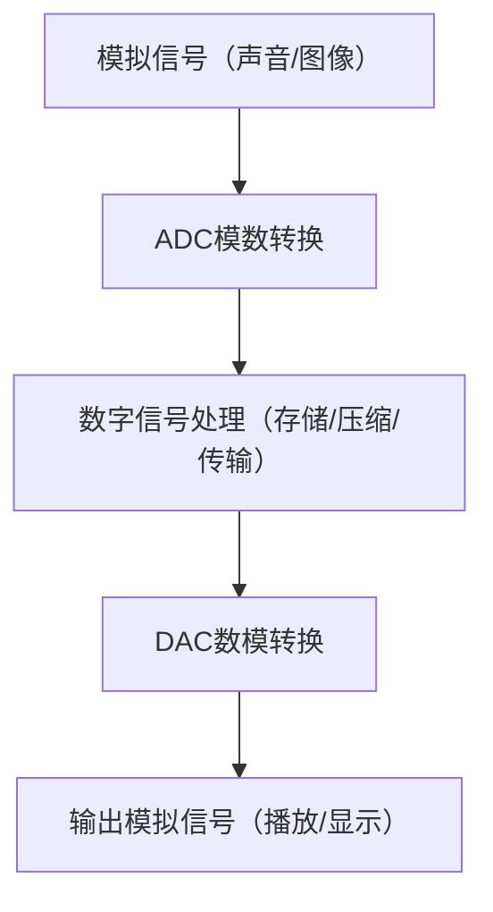

import WordCount from '../../../../src/components/WordCount/WordCount';

<WordCount>

## 1.1 数字信号与数字电路

### 1.1.1 数字技术的发展及其应用

📘 一、电子器件发展历程（时间线表格）

| 时期 | 代表性器件 | 特点与影响 |
|------|------------|------------|
| 20世纪初至中叶 | 真空管（电子管） | 早期电子技术基础，体积大、功耗高 |
| 1947年 | 晶体管问世 | 开创固体微电子学，体积小、可靠性高 |
| 20世纪60年代初 | 模拟与数字集成电路 | 实现电路集成化，提升性能和可靠性 |
| 20世纪70年代 | 微处理器问世 | 推动计算机普及，应用领域大幅扩展 |
| 20世纪80年代末 | 芯片晶体管数突破百万 | 集成度大幅提升，计算能力增强 |
| 20世纪90年代末 | 千万级晶体管芯片 | 制造工艺进步，性能进一步提升 |
| 当前 | 数十亿晶体管芯片 | 高集成度、高性能，符合摩尔定律 |

> **摩尔定律**：集成电路的集成度每18个月翻一番。

📦 二、数字技术应用领域总结

| 应用领域 | 传统技术 | 数字技术 | 优势 |
|----------|----------|----------|------|
| **音频存储** | 唱片、磁带（模拟信号） | CD（数字信号） | 便于存储、传输、处理，音质好 |
| **视频存储** | 录像带（模拟信号） | DVD（数字压缩格式） | 容量大、画质好、支持压缩 |
| **图像记录** | 胶片相机（模拟） | 数码相机（数字像素阵列） | 便于存储、传输、编辑，支持压缩 |
| **交通控制** | 机电定时器、继电器控制 | 计算机智能控制 | 实时响应、自适应调整、可靠性高 |
| **压缩标准** | 无或简单编码 | MPEG（视频）、JPEG（图像） | 高压缩比、低数据损失、标准化 |

🧩 三、数字与模拟技术对比

| 方面 | 数字技术 | 模拟技术 |
|------|----------|----------|
| 信号类型 | 离散信号（0/1） | 连续信号（波形） |
| 处理方式 | 逻辑运算、存储、传输 | 放大、滤波、调制 |
| 优势 | 抗干扰强、易存储、易处理 | 直接对应物理量、实时性好 |
| 局限性 | 不能直接处理模拟信号 | 易受干扰、不易存储和传输 |
| 应用场景 | 计算机、通信、存储、控制 | 传感器、音频放大、射频传输 |
| 关系 | 需通过ADC/DAC与模拟系统交互 | 是数字系统与物理世界的桥梁 |

🔄 四、数字系统处理流程示意图（以音频/视频为例）

### 1.1.2 数字集成电路的分类及特点
### 1.1.3 模拟信号和数字信号
### 1.1.4 数字信号的描述方法

## 1.2 数制
### 1.2.1 十进制
### 1.2.2 二进制
### 1.2.3 十二进制之间的转换
### 1.2.4 十六进制和八进制

## 1.3 二进制数的算术运算
### 1.3.1 无符号二进制数的算术运算

### 1.3.2 带符号二进制数的减法运算

## 1.4 二进制代码
### 1.4.1 二-十进制码
### 1.4.2 格雷码
### 1.4.3 ASCII码

## 1.5 二值逻辑变量与基本逻辑运算
### 运算
### 运算

## 1.6 逻辑函数及其表示方法
### 1.6.1 逻辑函数的几种表示方法
### 1.6.2 逻辑函数表示方法之间的转换
### 1.6.3 小结
### 1.6.4 习题

</WordCount>