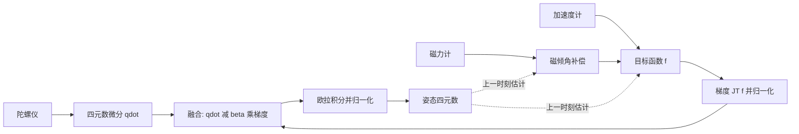

import WordCount from '../../../../src/components/WordCount/WordCount';

<WordCount>

Madgwick 滤波器要解决的问题和 Mahony 完全一样：陀螺仪短时精准但长期漂移，加速度计与磁力计长期可信但瞬时噪声大，需要把两者融合成稳定的姿态估计。区别只在**修正项怎么来**——Mahony 用测量方向与预测方向的叉乘直接构造反馈，Madgwick 则把"方向对齐"写成一个优化问题，用一步梯度下降给出修正方向。

原论文的三个卖点：只有一个可调参数 $\beta$；梯度下降经解析化简后计算量很小，低采样率下仍然可用；顺带给出在线磁倾角补偿。

整个算法最终会收敛成一行更新式：

$$
\mathbf{q}_t = \mathbf{q}_{t-1} + \big( \underbrace{\dot{\mathbf{q}}_{\omega, t}}_{\text{陀螺积分}} - \underbrace{\beta\, \hat{\nabla} F}_{\text{观测修正}} \big)\Delta t
$$

第 1 节的任务就是把这一行的每个部件推出来。数据流如下：



:::tip 阅读顺序
1.1–1.3 是四元数的基础准备，熟悉的话可以跳过；1.4–1.6 是算法的核心思想（目标函数与梯度）；1.7–1.8 解释那个唯一参数 $\beta$ 是怎么冒出来的；1.9–1.10 才代入重力和地磁得到能落地的公式；1.12 用一组具体数字把整条链走一遍。只想抄代码的话直接看第 2 节，但第 2.1 节末尾的警告值得一读。
:::

## 1. 算法推导

### 1.1 记号与坐标系

姿态用单位四元数表示：

$$
\mathbf{q} = \begin{bmatrix} q_w & q_x & q_y & q_z \end{bmatrix},
\qquad q_w^2 + q_x^2 + q_y^2 + q_z^2 = 1
\tag{1.1}
$$

有时也把它拆成标量部分与向量部分，记 $\mathbf{q} = (q_w, \mathbf{q}_v)$，其中 $\mathbf{q}_v = (q_x, q_y, q_z)$。

涉及两个坐标系：**地球系**（Earth frame，记 $E$）是重力和地磁方向已知的固定参考系；**传感器系**（Sensor frame，记 $S$）固连在器件上，随载体一起转动。约定 $\mathbf{q}$ 描述地球系相对传感器系的姿态。三维向量参与四元数运算时一律补零写成纯四元数，即 $\mathbf{x} = (x, y, z)$ 记为 $(0, x, y, z)$，所有乘法取 Hamilton 积。

两个方向的坐标变换分别是

$$
\,^S\mathbf{v} = \mathbf{q}^* \otimes \,^E\mathbf{v} \otimes \mathbf{q},
\qquad
\,^E\mathbf{v} = \mathbf{q} \otimes \,^S\mathbf{v} \otimes \mathbf{q}^*
\tag{1.2}
$$

其中 $\mathbf{q}^* = (q_w, -\mathbf{q}_v)$ 为共轭。这两个方向后面各有各的用处：前者把地球系的**已知参考方向**旋到传感器系，用来和实测比对（构造目标函数）；后者把传感器系的**实测方向**旋到地球系，用来做磁倾角补偿。

### 1.2 四元数运动学：$\dot{\mathbf{q}} = \frac{1}{2}\mathbf{q} \otimes \boldsymbol\omega$ 从哪来

陀螺仪给的是角速度，而我们要维护的是四元数，所以先要知道角速度如何驱动四元数变化。

设在 $\Delta t$ 内载体绕传感器系中的轴 $\mathbf{n}$（单位向量）转过小角 $\Delta\theta = |\boldsymbol\omega|\Delta t$。这个增量旋转对应的四元数是

$$
\Delta\mathbf{q} = \Big( \cos\tfrac{\Delta\theta}{2},\; \mathbf{n}\sin\tfrac{\Delta\theta}{2} \Big)
\;\xrightarrow[\ \Delta t \to 0\ ]{}\;
\Big( 1,\; \tfrac{1}{2}\boldsymbol\omega\,\Delta t \Big)
\tag{1.3}
$$

小角近似用了 $\cos\frac{\Delta\theta}{2} \approx 1$ 和 $\mathbf{n}\sin\frac{\Delta\theta}{2} \approx \mathbf{n}\frac{\Delta\theta}{2} = \frac{1}{2}\boldsymbol\omega\Delta t$。由于这个增量是在**传感器系**中描述的，姿态复合时它要乘在右边：$\mathbf{q}(t + \Delta t) = \mathbf{q}(t) \otimes \Delta\mathbf{q}$。代入并取极限：

$$
\dot{\mathbf{q}}
= \lim_{\Delta t \to 0} \frac{\mathbf{q} \otimes \Delta\mathbf{q} - \mathbf{q}}{\Delta t}
= \lim_{\Delta t \to 0} \frac{\mathbf{q} \otimes \big(\Delta\mathbf{q} - (1, \mathbf{0})\big)}{\Delta t}
= \tfrac{1}{2}\, \mathbf{q} \otimes \,^S\boldsymbol\omega
\tag{1.4}
$$

其中 $\,^S\boldsymbol\omega = (0, \omega_x, \omega_y, \omega_z)$ 是陀螺测得的角速度（rad/s）写成的纯四元数。把 Hamilton 积展开，就是代码里那四行：

$$
\begin{aligned}
\dot q_w &= \tfrac{1}{2}(-q_x \omega_x - q_y \omega_y - q_z \omega_z) \\
\dot q_x &= \tfrac{1}{2}( q_w \omega_x + q_y \omega_z - q_z \omega_y) \\
\dot q_y &= \tfrac{1}{2}( q_w \omega_y - q_x \omega_z + q_z \omega_x) \\
\dot q_z &= \tfrac{1}{2}( q_w \omega_z + q_x \omega_y - q_y \omega_x)
\end{aligned}
\tag{1.5}
$$

前向欧拉积分给出**仅由角速度推得**的姿态，下标 $\omega$ 就是这个意思：

$$
\mathbf{q}_{\omega, t}
= \mathbf{q}_{t-1} + \dot{\mathbf{q}}_{\omega, t}\, \Delta t
= \mathbf{q}_{t-1} + \tfrac{1}{2}\big(\mathbf{q}_{t-1} \otimes \,^S\boldsymbol\omega_t\big)\Delta t
\tag{1.6}
$$

问题在于陀螺读数含零偏和噪声，式 (1.6) 会把它们一并积分，误差随时间无界增长。所以必须引入外部方向观测——这就是下一步。

### 1.3 把"方向对齐"写成目标函数

先想清楚可以利用什么信息。地球系中存在一些**方向已知**的物理量（重力朝下、地磁指北），传感器能在自己的坐标系里**测到**这些方向。如果姿态估计正确，那么把已知参考方向按式 (1.2) 旋到传感器系，结果应该和实测方向重合。姿态错了，两者就会有夹角。

于是记地球系参考方向 $\,^E\mathbf{d} = (0, d_x, d_y, d_z)$，传感器实测方向 $\,^S\mathbf{s} = (0, s_x, s_y, s_z)$（都已归一化），定义误差

$$
f(\mathbf{q}, \,^E\mathbf{d}, \,^S\mathbf{s})
= \mathbf{q}^* \otimes \,^E\mathbf{d} \otimes \mathbf{q} - \,^S\mathbf{s}
\tag{1.7}
$$

要把它展开成能求导的形式，用四元数旋转的向量恒等式。对 $\mathbf{q} = (q_w, \mathbf{q}_v)$ 和三维向量 $\mathbf{d}$：

$$
\mathbf{q}^* \otimes \mathbf{d} \otimes \mathbf{q}
= (q_w^2 - |\mathbf{q}_v|^2)\,\mathbf{d}
+ 2(\mathbf{q}_v \cdot \mathbf{d})\,\mathbf{q}_v
- 2q_w\,(\mathbf{q}_v \times \mathbf{d})
\tag{1.8}
$$

这正是把 $\mathbf{d}$ 从地球系旋到传感器系的操作，写成矩阵就是

$$
\mathbf{q}^* \otimes \mathbf{d} \otimes \mathbf{q} = R^T \mathbf{d},
\qquad
R^T =
\begin{bmatrix}
1 - 2(q_y^2 + q_z^2) & 2(q_x q_y + q_w q_z) & 2(q_x q_z - q_w q_y) \\
2(q_x q_y - q_w q_z) & 1 - 2(q_x^2 + q_z^2) & 2(q_y q_z + q_w q_x) \\
2(q_x q_z + q_w q_y) & 2(q_y q_z - q_w q_x) & 1 - 2(q_x^2 + q_y^2)
\end{bmatrix}
\tag{1.9}
$$

把式 (1.9) 代入式 (1.7)，并把每一项的系数 $2$ 提到括号外（这就是原论文里那些 $\frac{1}{2}$ 的来历：$1 - 2q_y^2 - 2q_z^2 = 2(\frac{1}{2} - q_y^2 - q_z^2)$），得到目标函数的标准形式：

$$
f(\mathbf{q}, \,^E\mathbf{d}, \,^S\mathbf{s}) =
\begin{bmatrix}
2d_x(\tfrac{1}{2} - q_y^2 - q_z^2) + 2d_y(q_w q_z + q_x q_y) + 2d_z(q_x q_z - q_w q_y) - s_x \\
2d_x(q_x q_y - q_w q_z) + 2d_y(\tfrac{1}{2} - q_x^2 - q_z^2) + 2d_z(q_w q_x + q_y q_z) - s_y \\
2d_x(q_w q_y + q_x q_z) + 2d_y(q_y q_z - q_w q_x) + 2d_z(\tfrac{1}{2} - q_x^2 - q_y^2) - s_z
\end{bmatrix}
\tag{1.10}
$$

姿态估计因此变成一个优化问题：

$$
\min_{\mathbf{q}}\; f(\mathbf{q}, \,^E\mathbf{d}, \,^S\mathbf{s})
\tag{1.11}
$$

:::note 这里是两种滤波器的分岔口
同样面对"预测方向 vs 测量方向"，Mahony 直接取两者叉乘当作纠偏旋转轴，几何直觉强、计算便宜；Madgwick 把它当最小二乘问题，靠梯度方向纠偏，代价是要算雅可比，好处是多路观测可以自然地堆叠在一起（见 1.10 节）。式 (1.10) 的三个分量就是"预测方向减实测方向"的三个坐标分量，两种算法用的观测信息完全相同。
:::

### 1.4 从目标函数到梯度：为什么是 $J^T f$

式 (1.10) 的 $f$ 是三维向量，而"最小化一个向量"严格来说没有定义。真正要最小化的是它的平方和，即标量代价

$$
F(\mathbf{q}) = \tfrac{1}{2}\, f^T f = \tfrac{1}{2}\|f\|^2
\tag{1.12}
$$

对 $\mathbf{q}$ 的第 $i$ 个分量求偏导，用链式法则：

$$
\frac{\partial F}{\partial q_i}
= \sum_{k=1}^{3} f_k \frac{\partial f_k}{\partial q_i}
= \big( J^T f \big)_i
\quad\Longrightarrow\quad
\nabla F = J^T f
\tag{1.13}
$$

其中 $J$ 是 $f$ 对四元数四个分量的雅可比矩阵，尺寸 $3 \times 4$：

$$
J(\mathbf{q}, \,^E\mathbf{d}) =
\begin{bmatrix}
\dfrac{\partial f}{\partial q_w} & \dfrac{\partial f}{\partial q_x} & \dfrac{\partial f}{\partial q_y} & \dfrac{\partial f}{\partial q_z}
\end{bmatrix}
\tag{1.14}
$$

:::tip 记号提醒
原论文和多数资料把梯度写作 $\nabla f$，但它其实是标量代价 $F = \frac{1}{2}\|f\|^2$ 的梯度，不是向量函数 $f$ 的"梯度"（那应该是雅可比）。理解成式 (1.13) 就不会混乱：$J^T$ 把三维的测量残差映射回四维的四元数空间，告诉我们"四元数往哪个方向动，能让残差平方和下降最快"。
:::

逐项求导即可得到 $J$。比如第一行第一列，对 $f_1$ 求 $\partial / \partial q_w$，式 (1.10) 中含 $q_w$ 的只有 $2d_y q_w q_z$ 和 $-2d_z q_w q_y$ 两项，于是

$$
\frac{\partial f_1}{\partial q_w} = 2d_y q_z - 2d_z q_y
$$

其余 11 项同理，完整结果为

$$
J(\mathbf{q}, \,^E\mathbf{d}) =
\begin{bmatrix}
2d_y q_z - 2d_z q_y & 2d_y q_y + 2d_z q_z & -4d_x q_y + 2d_y q_x - 2d_z q_w & -4d_x q_z + 2d_y q_w + 2d_z q_x \\
-2d_x q_z + 2d_z q_x & 2d_x q_y - 4d_y q_x + 2d_z q_w & 2d_x q_x + 2d_z q_z & -2d_x q_w - 4d_y q_z + 2d_z q_y \\
2d_x q_y - 2d_y q_x & 2d_x q_z - 2d_y q_w - 4d_z q_x & 2d_x q_w + 2d_y q_z - 4d_z q_y & 2d_x q_x + 2d_y q_y
\end{bmatrix}
\tag{1.15}
$$

维度上检查一遍：$J^T$ 是 $4 \times 3$，$f$ 是 $3 \times 1$，所以 $\nabla F = J^T f$ 是 $4 \times 1$，恰好和四元数同维，可以直接相加。

式 (1.10) 与 (1.15) 对**任意**参考方向都成立，IMU 与 MARG 只是代入不同的 $\,^E\mathbf{d}$ 而已。

### 1.5 一次梯度下降

标准梯度下降从初值 $\mathbf{q}_0$ 出发，以步长 $\mu$ 迭代：

$$
\mathbf{q}_{k+1} = \mathbf{q}_k - \mu\, \frac{\nabla F(\mathbf{q}_k)}{\|\nabla F(\mathbf{q}_k)\|},
\qquad k = 0, 1, 2, \ldots
\tag{1.16}
$$

注意这里除以了梯度模长，只保留**方向**。滤波器每个采样周期**只迭代一次**，并且以上一时刻的估计作为起点——因为相邻两帧姿态变化很小，上一帧的结果已经是很好的初值：

$$
\mathbf{q}_{\nabla, t} = \mathbf{q}_{t-1} - \mu_t\, \frac{\nabla F}{\|\nabla F\|}
\tag{1.17}
$$

至此我们有了两路互相独立的姿态估计：陀螺积分的 $\mathbf{q}_{\omega, t}$（式 1.6）和观测下降的 $\mathbf{q}_{\nabla, t}$（式 1.17）。

### 1.6 步长、融合权重，以及它们如何互相抵消

步长 $\mu_t$ 要保证 $\mathbf{q}_\nabla$ 的收敛速率不低于物体本身的转动速率，否则观测永远追不上运动：

$$
\mu_t = \alpha\, \|\dot{\mathbf{q}}_{\omega, t}\|\, \Delta t,
\qquad \alpha > 1
\tag{1.18}
$$

$\|\dot{\mathbf{q}}_{\omega, t}\|$ 是陀螺测得的物理转动速率，$\alpha$ 是应对加速度计 / 磁力计噪声的放大系数。

两路估计用互补滤波器加权融合：

$$
\mathbf{q}_t = \gamma_t\, \mathbf{q}_{\nabla, t} + (1 - \gamma_t)\, \mathbf{q}_{\omega, t},
\qquad 0 \le \gamma_t \le 1
\tag{1.19}
$$

最优权重应当使两路的加权发散率与加权收敛率相等：

$$
(1 - \gamma_t)\, \beta = \gamma_t\, \frac{\mu_t}{\Delta t}
\tag{1.20}
$$

左边 $\beta$ 是 $\mathbf{q}_\omega$ 的**发散速率**（陀螺测量误差对应的四元数导数模长），右边 $\mu_t / \Delta t$ 是 $\mathbf{q}_\nabla$ 的**收敛速率**。

现在做关键的化简。取很大的 $\alpha$，则 $\mu_t$ 很大，式 (1.17) 中的 $\mathbf{q}_{t-1}$ 相对梯度项可以忽略：

$$
\mathbf{q}_{\nabla, t} \approx -\mu_t\, \frac{\nabla F}{\|\nabla F\|}
\tag{1.21}
$$

同时式 (1.20) 解出的 $\gamma_t = \dfrac{\beta}{\beta + \mu_t/\Delta t}$ 在 $\mu_t$ 很大时简化为

$$
\gamma_t \approx \frac{\beta\, \Delta t}{\mu_t} \to 0
\tag{1.22}
$$

把式 (1.21)、(1.22) 一起代回式 (1.19)：

$$
\begin{aligned}
\mathbf{q}_t
&= \gamma_t\Big( -\mu_t \frac{\nabla F}{\|\nabla F\|} \Big) + (1 - \gamma_t)\big( \mathbf{q}_{t-1} + \dot{\mathbf{q}}_{\omega,t}\Delta t \big) \\
&= -\frac{\beta \Delta t}{\mu_t}\, \mu_t \frac{\nabla F}{\|\nabla F\|} + (1 - \gamma_t)\big( \mathbf{q}_{t-1} + \dot{\mathbf{q}}_{\omega,t}\Delta t \big) \\
&\approx \mathbf{q}_{t-1} + \dot{\mathbf{q}}_{\omega,t}\Delta t - \beta\, \frac{\nabla F}{\|\nabla F\|}\Delta t
\end{aligned}
\tag{1.23}
$$

第二行里 $\mu_t$ 被约掉了，第三行用了 $\gamma_t \to 0$。整理成最终形式：

$$
\mathbf{q}_t
= \mathbf{q}_{t-1} + \big( \dot{\mathbf{q}}_{\omega, t} - \beta\, \dot{\mathbf{q}}_{\epsilon, t} \big)\Delta t,
\qquad
\dot{\mathbf{q}}_{\epsilon, t} = \frac{\nabla F}{\|\nabla F\|}
\tag{1.24}
$$

含义相当直接：用陀螺算出姿态变化率，再沿估计误差方向 $\dot{\mathbf{q}}_{\epsilon, t}$ 扣掉大小为 $\beta$ 的一块，然后积分。$\alpha$ 和 $\mu_t$ 双双消失，只剩 $\beta$，这正是原论文强调的"单一可调参数"。

:::tip 为什么梯度必须归一化
式 (1.24) 里用的是 $\nabla F / \|\nabla F\|$ 而不是 $\nabla F$。归一化之后修正量的**大小**完全由 $\beta$ 决定，梯度只提供**方向**。这样 $\beta$ 才具有"陀螺误差速率"的明确物理量纲（rad/s 量级），调参也不会随加速度计读数幅值漂移。代价是靠近最优点时步长不会自动变小，估计会在真值附近以 $\beta\Delta t$ 的幅度轻微抖动。
:::

### 1.7 IMU：以重力为参考

前面都是通用推导，现在代入具体的物理量。6 轴情形只有重力一个参考方向，按惯例取地球系 Z 轴沿重力：

$$
\,^E\mathbf{g} = \begin{bmatrix} 0 & 0 & 0 & 1 \end{bmatrix}
\tag{1.25}
$$

即 $d_x = d_y = 0$、$d_z = 1$。代入式 (1.10)，含 $d_x, d_y$ 的项全部消失：

$$
f_g(\mathbf{q}, \,^S\mathbf{a}) =
\begin{bmatrix}
2(q_x q_z - q_w q_y) - a_x \\
2(q_w q_x + q_y q_z) - a_y \\
2(\tfrac{1}{2} - q_x^2 - q_y^2) - a_z
\end{bmatrix}
\tag{1.26}
$$

其中 $\,^S\mathbf{a} = (0, a_x, a_y, a_z)$ 是**归一化后**的加速度计测量。同样代入式 (1.15) 得雅可比：

$$
J_g(\mathbf{q}) =
\begin{bmatrix}
-2q_y & 2q_z & -2q_w & 2q_x \\
2q_x & 2q_w & 2q_z & 2q_y \\
0 & -4q_x & -4q_y & 0
\end{bmatrix}
\tag{1.27}
$$

:::note 式 (1.26) 的几何含义
括号里那三项正是式 (1.9) 中 $R^T$ 的第三列，即地球系 Z 轴在传感器系下的投影——和 Mahony 笔记式 (1.6) 的"预测重力方向"是同一个东西。所以 $f_g$ 就是预测重力方向减去实测重力方向。注意加速度计测的是比力，把它当重力方向用隐含了准静态假设，这一点与 Mahony 完全相同。
:::

梯度由上一时刻估计与当前测量算出：

$$
\nabla F = J_g^T(\mathbf{q}_{t-1})\, f_g(\mathbf{q}_{t-1}, \,^S\mathbf{a}_t)
\tag{1.28}
$$

代入式 (1.24)，6 轴 Madgwick 的完整更新为

$$
\mathbf{q}_t = \mathbf{q}_{t-1}
+ \Big( \dot{\mathbf{q}}_{\omega, t} - \beta\, \frac{J_g^T f_g}{\|J_g^T f_g\|} \Big)\Delta t
\tag{1.29}
$$

把式 (1.28) 按矩阵乘法展开成标量，就是下一节代码里 `step` 的四个分量：

$$
J_g^T f_g =
\begin{bmatrix}
-2q_y f_1 + 2q_x f_2 \\
2q_z f_1 + 2q_w f_2 - 4q_x f_3 \\
-2q_w f_1 + 2q_z f_2 - 4q_y f_3 \\
2q_x f_1 + 2q_y f_2
\end{bmatrix}
\tag{1.30}
$$

### 1.8 MARG：加入地磁与磁倾角补偿

重力只能约束 Roll 与 Pitch：绕重力轴转动时，重力在传感器系下的投影不变，因此 Yaw 不可观。要长期稳住航向，需要第二个不与重力平行的参考方向，通常取地磁场。

地球系地磁矢量在 NED 坐标下三轴都有分量，可由 WMM 查得。Madgwick 假设东向（Y 轴）分量可忽略，把参考简化为只在 X、Z 轴上：

$$
\,^E\mathbf{b} = \begin{bmatrix} 0 & b_x & 0 & b_z \end{bmatrix}
\tag{1.31}
$$

巧妙之处在于 $b_x, b_z$ 不是预先设定的常数，而是**每一步由测量反推**。先把归一化磁力计读数用上一时刻姿态旋到地球系（式 1.2 的第二式）：

$$
\,^E\mathbf{h}_t = \begin{bmatrix} 0 & h_x & h_y & h_z \end{bmatrix}
= \mathbf{q}_{t-1} \otimes \,^S\mathbf{m}_t \otimes \mathbf{q}_{t-1}^*
\tag{1.32}
$$

再把两个水平分量合并到 X 轴上：

$$
\,^E\mathbf{b}_t = \begin{bmatrix} 0 & \sqrt{h_x^2 + h_y^2} & 0 & h_z \end{bmatrix}
\tag{1.33}
$$

:::tip 式 (1.33) 到底在做什么
$\sqrt{h_x^2 + h_y^2}$ 是水平投影的模长，$h_z$ 原样保留，所以这一步保留了实测磁矢量的**磁倾角**（X 与 Z 的比例），只是把水平方向强行对齐到北。

这样构造的参考方向与测量方向天然同倾角，倾角误差不会串到 Roll / Pitch 上去，磁扰动的影响被限制在航向一个自由度内。附带好处是不必预先知道当地地磁参数——算法自己从数据里学。
:::

把式 (1.31)、(1.33) 与归一化磁力计测量代入通式 (1.10)、(1.15)，得到

$$
f_b(\mathbf{q}, \,^E\mathbf{b}, \,^S\mathbf{m}) =
\begin{bmatrix}
2b_x(\tfrac{1}{2} - q_y^2 - q_z^2) + 2b_z(q_x q_z - q_w q_y) - m_x \\
2b_x(q_x q_y - q_w q_z) + 2b_z(q_w q_x + q_y q_z) - m_y \\
2b_x(q_w q_y + q_x q_z) + 2b_z(\tfrac{1}{2} - q_x^2 - q_y^2) - m_z
\end{bmatrix}
\tag{1.34}
$$

$$
J_b(\mathbf{q}, \,^E\mathbf{b}) =
\begin{bmatrix}
-2b_z q_y & 2b_z q_z & -4b_x q_y - 2b_z q_w & -4b_x q_z + 2b_z q_x \\
-2b_x q_z + 2b_z q_x & 2b_x q_y + 2b_z q_w & 2b_x q_x + 2b_z q_z & -2b_x q_w + 2b_z q_y \\
2b_x q_y & 2b_x q_z - 4b_z q_x & 2b_x q_w - 4b_z q_y & 2b_x q_x
\end{bmatrix}
\tag{1.35}
$$

两路观测怎么合并？回到式 (1.12)：总代价就是两路残差平方和相加，$F = \frac{1}{2}(\|f_g\|^2 + \|f_b\|^2)$，这等价于把残差上下堆成一个六维向量，雅可比也相应堆成 $6 \times 4$：

$$
f_{g,b} = \begin{bmatrix} f_g \\ f_b \end{bmatrix} \in \mathbb{R}^6,
\qquad
J_{g,b} = \begin{bmatrix} J_g \\ J_b \end{bmatrix} \in \mathbb{R}^{6 \times 4}
\tag{1.36}
$$

只要北向磁强度不为零（$b_x \ne 0$），重力与地磁两个方向就能唯一确定姿态，代价曲面上有唯一极小点。9 轴更新式与式 (1.29) 完全同构：

$$
\mathbf{q}_t = \mathbf{q}_{t-1}
+ \Big( \dot{\mathbf{q}}_{\omega, t} - \beta\, \frac{J_{g,b}^T f_{g,b}}{\|J_{g,b}^T f_{g,b}\|} \Big)\Delta t
\tag{1.37}
$$

:::note 这正是"堆叠"写法的好处
Mahony 合并两路观测时要手工给两个叉乘项分别配权重 $k_1, k_2$。Madgwick 这里直接把残差摞起来，最小二乘框架自动完成了加权——权重隐含在各路残差的量纲里（都已归一化，所以等权）。想给某路降权，只需在对应残差块前乘一个系数。
:::

### 1.9 增益 $\beta$：$\sqrt{3/4}$ 从哪来

式 (1.24) 里 $\beta$ 与 $\dot{\mathbf{q}}$ 相加，所以它的量纲必须是**四元数导数**，而我们手上掌握的是**角速度**误差，需要换算。

对单位四元数，Hamilton 积保范数，由式 (1.4) 立刻得到

$$
\|\dot{\mathbf{q}}\| = \tfrac{1}{2}\|\mathbf{q}\|\,\|\boldsymbol\omega\| = \tfrac{1}{2}\|\boldsymbol\omega\|
\tag{1.38}
$$

设陀螺三个轴各有零均值误差，每轴的标准差为 $\bar\omega_\beta$（rad/s）。三轴独立，合成角速度误差的模长为 $\|\boldsymbol\omega_\text{err}\| = \sqrt{3}\,\bar\omega_\beta$。代入式 (1.38)：

$$
\beta = \|\dot{\mathbf{q}}_\text{err}\| = \tfrac{1}{2}\sqrt{3}\,\bar\omega_\beta = \sqrt{\tfrac{3}{4}}\,\bar\omega_\beta
\tag{1.39}
$$

这就是那个看着有点奇怪的 $\sqrt{3/4}$ 的来历——不过是 $\frac{\sqrt3}{2}$ 换了个写法。

实践中直接查数据手册的零偏稳定性，或者实测静止方差即可。`ahrs` 库按原论文取默认值：6 轴 IMU 用 $\beta = 0.033$，9 轴 MARG 用 $\beta = 0.041$。

:::note 调参方向
$\beta$ 大则收敛快、跟得上初始对准，但震动和磁扰会更多地污染姿态；$\beta$ 小则平滑抗扰，但陀螺零偏纠正得慢。

给个量化的感觉：静止载体真实倾角 $30^\circ$、估计从零开始、采样率 100 Hz 时，收敛到 $1^\circ$ 以内所需时间约为 $\beta = 0.033$ 时 $8.0$ s，$\beta = 0.1$ 时 $2.6$ s，$\beta = 0.5$ 时 $0.53$ s。常见做法是启动阶段临时放大 $\beta$ 快速收敛，稳定后再降回正常值。
:::

### 1.10 一次更新的数值演算

把整条链用一组具体数字走一遍。设载体静止、绕 X 轴真实倾斜 $30^\circ$，而滤波器当前估计还停在单位四元数（以为自己是水平的），陀螺读数为零，$\beta = 0.1$，$\Delta t = 0.01\ \mathrm{s}$。

**第一步，加速度计读数。** 真实姿态下重力在传感器系的投影为

$$
\,^S\mathbf{a} = (0,\; \sin 30^\circ,\; \cos 30^\circ) = (0,\; 0.5,\; 0.866)
$$

**第二步，目标函数。** 当前估计 $\mathbf{q} = (1, 0, 0, 0)$，代入式 (1.26)：

$$
f_g =
\begin{bmatrix}
2(0 - 0) - 0 \\
2(0 + 0) - 0.5 \\
2(\tfrac{1}{2} - 0 - 0) - 0.866
\end{bmatrix}
=
\begin{bmatrix}
0 \\ -0.5 \\ 0.134
\end{bmatrix}
$$

代价 $F = \frac{1}{2}\|f_g\|^2 = 0.1340$。

**第三步，雅可比与梯度。** 在 $\mathbf{q} = (1,0,0,0)$ 处，式 (1.27) 大量元素归零：

$$
J_g =
\begin{bmatrix}
0 & 0 & -2 & 0 \\
0 & 2 & 0 & 0 \\
0 & 0 & 0 & 0
\end{bmatrix}
\quad\Longrightarrow\quad
\nabla F = J_g^T f_g =
\begin{bmatrix}
0 \\ 2 \times (-0.5) \\ -2 \times 0 \\ 0
\end{bmatrix}
=
\begin{bmatrix}
0 \\ -1 \\ 0 \\ 0
\end{bmatrix}
$$

模长恰为 $1$，归一化后不变。

**第四步，更新。** 陀螺读数为零故 $\dot{\mathbf{q}}_\omega = 0$，由式 (1.24)：

$$
\mathbf{q}_t = (1,0,0,0) - 0.1 \times (0,-1,0,0) \times 0.01 = (1,\; 0.001,\; 0,\; 0)
$$

归一化后对应绕 X 轴转 $0.1146^\circ$，即估计从 $0^\circ$ 朝真值 $30^\circ$ 迈了一小步；新的代价降到 $0.1330$。

这个例子里有两个值得留意的地方：

**梯度恰好只有 $q_x$ 分量。** 四元数在 $q_x$ 方向的扰动对应的正是绕 X 轴的旋转，而这里的姿态误差本来就是纯 Roll。算法自动找对了旋转轴——这不是巧合，$J^T$ 的作用就是把测量残差映射成"该往哪个方向转"。

**$f_3 = 0.134$ 这个残差没有进入梯度。** 因为 $J_g$ 的第三行在单位四元数处全为零。几何上，Z 轴投影的偏差是倾角的二阶小量，不能直接纠正，只能随着 Roll 被修正而自动消失。

## 2. 代码实现

### 2.1 6 轴（陀螺 + 加速度计）

各步与第 1 节公式的对应关系：

| 步骤 | 做什么 | 对应公式 |
|---|---|---|
| 第一步 | 归一化加速度计 | 式 (1.26) 的 $\,^S\mathbf{a}$ |
| 第二步 | 构造目标函数 $f_g$ | 式 (1.26) |
| 第三步 | 计算梯度 $J_g^T f_g$ 并归一化 | 式 (1.27)、(1.30) |
| 第四步 | 陀螺四元数微分 | 式 (1.5) |
| 第五步 | 融合并欧拉积分 | 式 (1.24)、(1.29) |
| 第六步 | 归一化四元数 | 保持单位模长 |

```python
import numpy as np

beta = 0.033  # 算法唯一需要调节的增益参数，见式 (1.39)


def madgwick_update_6dof(q, gx, gy, gz, ax, ay, az, dt):
    """
    q: 当前姿态四元数 [qw, qx, qy, qz]
    gx, gy, gz: 陀螺仪角速度 (rad/s)
    ax, ay, az: 加速度计数据 (任意单位，只用方向)
    dt: 采样时间间隔 (s)
    """
    qw, qx, qy, qz = q

    # 【第一步】归一化加速度计数据
    norm = np.sqrt(ax**2 + ay**2 + az**2)
    if norm == 0.0:
        return q  # 自由落体或数据异常，本周期放弃修正
    ax, ay, az = ax / norm, ay / norm, az / norm

    # 【第二步】目标函数 f_g → 式 (1.26)
    # 前两项是"预测重力方向"，减去实测方向即为残差
    f_1 = 2.0 * (qx * qz - qw * qy) - ax
    f_2 = 2.0 * (qw * qx + qy * qz) - ay
    f_3 = 2.0 * (0.5 - qx**2 - qy**2) - az

    # 【第三步】梯度 step = J_g^T @ f_g → 式 (1.27)、(1.30)
    # J_g 的四列分别对 qw, qx, qy, qz 求导，转置后与 f_g 相乘
    step_w = -2.0 * qy * f_1 + 2.0 * qx * f_2
    step_x = 2.0 * qz * f_1 + 2.0 * qw * f_2 - 4.0 * qx * f_3
    step_y = -2.0 * qw * f_1 + 2.0 * qz * f_2 - 4.0 * qy * f_3
    step_z = 2.0 * qx * f_1 + 2.0 * qy * f_2

    # 归一化梯度：只取方向，大小交给 beta 决定
    norm = np.sqrt(step_w**2 + step_x**2 + step_y**2 + step_z**2)
    if norm > 0.0:
        step_w, step_x = step_w / norm, step_x / norm
        step_y, step_z = step_y / norm, step_z / norm

    # 【第四步】陀螺仪四元数微分 → 式 (1.5)
    q_dot_w = 0.5 * (-qx * gx - qy * gy - qz * gz)
    q_dot_x = 0.5 * ( qw * gx + qy * gz - qz * gy)
    q_dot_y = 0.5 * ( qw * gy - qx * gz + qz * gx)
    q_dot_z = 0.5 * ( qw * gz + qx * gy - qy * gx)

    # 【第五步】陀螺微分减去 beta * 梯度方向，再积分 → 式 (1.29)
    qw += (q_dot_w - beta * step_w) * dt
    qx += (q_dot_x - beta * step_x) * dt
    qy += (q_dot_y - beta * step_y) * dt
    qz += (q_dot_z - beta * step_z) * dt

    # 【第六步】归一化四元数
    norm = np.sqrt(qw**2 + qx**2 + qy**2 + qz**2)
    return [qw / norm, qx / norm, qy / norm, qz / norm]
```

:::warning 第三步是最容易写错的地方
$J_g$ 里出现的元素只有 $\pm 2q_w, \pm 2q_x, \pm 2q_y, \pm 2q_z$ 和 $-4q_x, -4q_y$ 这几种，很多实现为了省乘法会给它们起 `J_11_or_24` 之类的别名复用，一旦别名对错列，就会把 $q_w$ 和 $q_y$ 混在一起。

这种错误尤其隐蔽：真实姿态处 $f_g = 0$，因而错误的步长在那里同样为零，静止对准时看着照样收敛。但随机采样表明，约 10% 的姿态 / 测量组合下错误步长与真实梯度夹角超过 90°，即变成了**上升方向**，把姿态往远离观测的方向推。在带零偏和噪声的动态仿真中，正确实现的倾角误差均值约 $0.4^\circ$，错误实现则劣化到约 $8^\circ$、峰值接近 $40^\circ$。

稳妥做法是先老老实实按式 (1.30) 写出来，再与官方 C 实现的展开式逐项对拍。
:::

### 2.2 9 轴（MARG）

9 轴版本多了磁倾角补偿和第二组目标函数，直接照式 (1.36) 用矩阵形式写更清楚：

```python
import numpy as np


def _quat_mul(a, b):
    """Hamilton 积"""
    aw, ax, ay, az = a
    bw, bx, by, bz = b
    return np.array([
        aw * bw - ax * bx - ay * by - az * bz,
        aw * bx + ax * bw + ay * bz - az * by,
        aw * by - ax * bz + ay * bw + az * bx,
        aw * bz + ax * by - ay * bx + az * bw,
    ])


def _rotate_to_earth(q, v):
    """^E v = q ⊗ ^S v ⊗ q*  → 式 (1.32)"""
    qv = _quat_mul(_quat_mul(q, np.array([0.0, *v])),
                   np.array([q[0], -q[1], -q[2], -q[3]]))
    return qv[1:]


def madgwick_update_9dof(q, gyr, acc, mag, dt, beta=0.041):
    """
    q: 当前姿态四元数 ndarray([qw, qx, qy, qz])
    gyr: 角速度 (rad/s)，acc: 加速度，mag: 磁场
    """
    q = np.asarray(q, dtype=float)
    qw, qx, qy, qz = q

    if np.linalg.norm(acc) == 0.0 or np.linalg.norm(mag) == 0.0:
        return q
    ax, ay, az = np.asarray(acc, dtype=float) / np.linalg.norm(acc)
    mx, my, mz = np.asarray(mag, dtype=float) / np.linalg.norm(mag)

    # 磁倾角补偿：把测量旋到地球系后，水平分量并入 X 轴 → 式 (1.32)、(1.33)
    hx, hy, hz = _rotate_to_earth(q, np.array([mx, my, mz]))
    bx, bz = np.sqrt(hx**2 + hy**2), hz

    # 重力目标函数与雅可比 → 式 (1.26)、(1.27)
    f_g = np.array([
        2.0 * (qx * qz - qw * qy) - ax,
        2.0 * (qw * qx + qy * qz) - ay,
        2.0 * (0.5 - qx**2 - qy**2) - az,
    ])
    J_g = np.array([
        [-2.0 * qy, 2.0 * qz, -2.0 * qw, 2.0 * qx],
        [ 2.0 * qx, 2.0 * qw,  2.0 * qz, 2.0 * qy],
        [      0.0, -4.0 * qx, -4.0 * qy,     0.0],
    ])

    # 地磁目标函数与雅可比 → 式 (1.34)、(1.35)
    f_b = np.array([
        2.0 * bx * (0.5 - qy**2 - qz**2) + 2.0 * bz * (qx * qz - qw * qy) - mx,
        2.0 * bx * (qx * qy - qw * qz) + 2.0 * bz * (qw * qx + qy * qz) - my,
        2.0 * bx * (qw * qy + qx * qz) + 2.0 * bz * (0.5 - qx**2 - qy**2) - mz,
    ])
    J_b = np.array([
        [-2.0 * bz * qy, 2.0 * bz * qz,
         -4.0 * bx * qy - 2.0 * bz * qw, -4.0 * bx * qz + 2.0 * bz * qx],
        [-2.0 * bx * qz + 2.0 * bz * qx, 2.0 * bx * qy + 2.0 * bz * qw,
          2.0 * bx * qx + 2.0 * bz * qz, -2.0 * bx * qw + 2.0 * bz * qy],
        [ 2.0 * bx * qy, 2.0 * bx * qz - 4.0 * bz * qx,
          2.0 * bx * qw - 4.0 * bz * qy, 2.0 * bx * qx],
    ])

    # 两路观测堆叠后求梯度 → 式 (1.36)
    f = np.concatenate([f_g, f_b])
    J = np.vstack([J_g, J_b])
    grad = J.T @ f
    if np.linalg.norm(grad) > 0.0:
        grad = grad / np.linalg.norm(grad)

    # 陀螺微分并融合 → 式 (1.5)、(1.37)
    q_dot = 0.5 * _quat_mul(q, np.array([0.0, *gyr]))
    q = q + (q_dot - beta * grad) * dt
    return q / np.linalg.norm(q)
```

## 3. 工程要点

**初始姿态必须是单位四元数。** 不能用全零数组初始化。若没有给定初值，通常用第一帧数据在准静态假设下解算一个初始姿态。

**采样率可变时要传实际 $\Delta t$。** 式 (1.24) 是前向欧拉积分，$\Delta t$ 用错会直接体现为角度误差。采样抖动大的场合应每帧传入实测间隔而非标称周期。

**每步都要归一化四元数。** 欧拉积分会破坏单位模长，不归一化会让姿态缓慢失真。

**加速度计的准静态假设同样适用。** 式 (1.26) 默认加速度计读到的是纯重力。急加速、震动时该假设失效，此时可临时调小 $\beta$ 或按 $\|\mathbf{a}\|$ 是否接近 $g$ 做门限判断。

**磁力计需要标定。** 式 (1.33) 只能补偿磁倾角，补偿不了硬磁 / 软磁畸变。使用前应做椭球拟合标定，运行时监控 $\|\mathbf{m}\|$ 是否偏离当地地磁强度。

与 Mahony 的取舍：

| 维度 | Madgwick | Mahony |
|---|---|---|
| 修正来源 | 目标函数梯度 $J^T f$ | 测量与预测方向的叉乘 |
| 可调参数 | 仅 $\beta$ | $k_P$、$k_I$ |
| 陀螺零偏 | 靠 $\beta$ 项间接压制 | $k_I$ 积分项显式估计 |
| 多路观测合并 | 残差堆叠，最小二乘自动加权 | 手工配权重 $k_1, k_2$ |
| 计算量 | 略大（梯度与归一化） | 更小 |
| 低采样率（20~50 Hz） | 表现更好 | 相对逊色 |
| 长期恒定干扰 | 一般 | 积分项使其抗性略强 |

## 4. 常见疑问

**每周期只迭代一次梯度下降，够吗？** 够。相邻两帧之间姿态变化很小，上一帧的估计已经是很好的初值，所以这是一个"热启动"的迭代。真正保证跟得上运动的是式 (1.18) 对步长的要求，化简后体现为 $\beta$ 的取值。

**为什么修正项是从 $\dot{\mathbf{q}}$ 里减，而不是直接改 $\mathbf{q}$？** 两种写法在数学上等价（式 1.23 就是从直接修改 $\mathbf{q}$ 推出来的）。写成速率形式的好处是与陀螺项量纲一致，可以合并成一次积分，$\beta$ 也因此获得"角速度误差"的物理解释。

**Madgwick 能估计陀螺零偏吗？** 原论文的 MARG 版本给出了一个零偏补偿分支，思路是把误差方向的积分反馈到陀螺读数上，本质与 Mahony 的 $k_I$ 项相同。上面代码给的是不含零偏估计的常见简化版，依靠 $\beta$ 项间接压制。长期静置漂移明显时，建议补上零偏估计或改用 Mahony。

**四元数直接加上一个四维向量，还是合法姿态吗？** 严格说不是——单位四元数构成的是球面而非线性空间，相加会离开球面。算法靠每步末尾的归一化把它拉回去。因为每步位移量级只有 $\beta\Delta t$，这个近似的误差是高阶小量。这也是不能把 $\beta$ 或 $\Delta t$ 设得过大的原因之一。

**$\beta$ 到底该按哪个量纲理解？** 由式 (1.39)，$\beta$ 是"陀螺角速度误差的一半再乘 $\sqrt3$"，量纲与 $\|\dot{\mathbf{q}}\|$ 相同。粗略地说，$\beta = 0.033$ 对应每轴约 $0.038\ \mathrm{rad/s}$（约 $2.2^\circ/\mathrm{s}$）的陀螺误差。

## 5. 参考文献

[1] Sebastian O. H. Madgwick. *An efficient orientation filter for inertial and inertial/magnetic sensor arrays*. Technical Report, University of Bristol, 2010. [PDF](https://x-io.co.uk/downloads/madgwick_internal_report.pdf)

[2] x-io Technologies. [Open source IMU and AHRS algorithms](https://x-io.co.uk/open-source-imu-and-ahrs-algorithms/)（原始 C / C# / MATLAB 实现）

[3] Mario Garcia. *AHRS: Attitude and Heading Reference Systems* — [Madgwick Orientation Filter 文档](https://ahrs.readthedocs.io/en/latest/filters/madgwick.html)

[4] R. Mahony, T. Hamel, J.-M. Pflimlin. *Nonlinear Complementary Filters on the Special Orthogonal Group*. IEEE TAC, 2008.

</WordCount>
